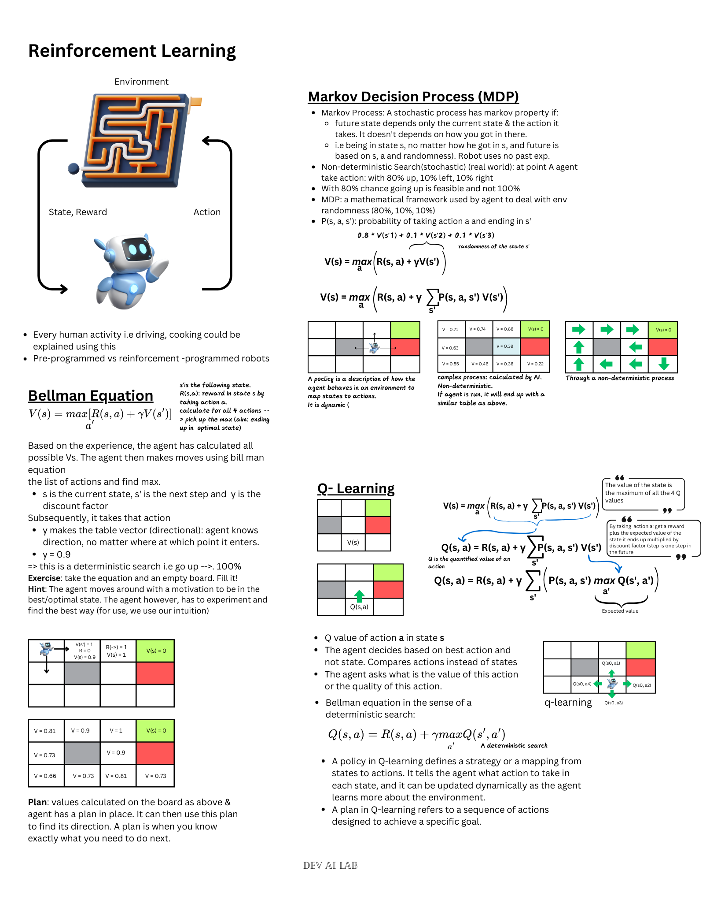

# AI, Machine Learning using Python
<!-- TOC -->
* [AI, Machine Learning using Python](#ai-machine-learning-using-python)
* [Python Basics](#python-basics)
  * [list](#list)
  * [dictionary](#dictionary)
  * [tuples](#tuples)
  * [sets](#sets)
  * [boolean](#boolean)
  * [I/O with Basic files](#io-with-basic-files)
  * [Control flow and loop](#control-flow-and-loop)
  * [Methods and functions](#methods-and-functions)
  * [OOPS in Python](#oops-in-python)
    * [Inheritance and Polymorphism](#inheritance-and-polymorphism)
    * [Magic/Dunder methods](#magicdunder-methods)
  * [Modules and packages](#modules-and-packages)
  * [Error and Exception Handling](#error-and-exception-handling)
  * [Python Unit Testing](#python-unit-testing)
  * [Python Decorator](#python-decorator)
  * [Python Generator](#python-generator)
  * [Advanced Python Modules](#advanced-python-modules)
  * [Web scraping - downloading images etc](#web-scraping---downloading-images-etc)
  * [Working with Images in Python](#working-with-images-in-python)
  * [Working with PDFs and Spreadsheet CSV](#working-with-pdfs-and-spreadsheet-csv)
  * [Email with Python](#email-with-python)
  * [Advanced Python Objects](#advanced-python-objects)
  * [GUIs in python](#guis-in-python)
  * [Final Capstone Project](#final-capstone-project)
  * [Python Setup](#python-setup)
* [Mathematical Foundation for ML](#mathematical-foundation-for-ml)
  * [Linear Algebra:](#linear-algebra)
* [AI](#ai)
  * [Responsible AI](#responsible-ai)
  * [Protect your data](#protect-your-data)
  * [Good start](#good-start)
  * [Reinforcement Learning](#reinforcement-learning)
    * [Ballman Equation](#ballman-equation)
    * [Markov Decision Process (MDP)](#markov-decision-process-mdp)
    * [Policy vs Plan](#policy-vs-plan)
    * [Living Penalty of the agent](#living-penalty-of-the-agent)
    * [Q-Learning (value of actions)](#q-learning-value-of-actions)
      * [Temporal Difference (How AI updates itself)](#temporal-difference-how-ai-updates-itself)
      * [Additional Reading](#additional-reading)
    * [Deep Q-Learning Intuition](#deep-q-learning-intuition)
      * [Q-learning intuition (Learning)](#q-learning-intuition-learning)
      * [Q-learning intuition (Acting)](#q-learning-intuition-acting)
      * [Experience Replay](#experience-replay)
      * [Action Selection Policies: uses exploration and exploitation.](#action-selection-policies-uses-exploration-and-exploitation)
    * [Deep Convolutional Q-Learning](#deep-convolutional-q-learning)
  * [Links](#links)
* [Additional Machine Learning Topics](#additional-machine-learning-topics)
  * [Multi-modal embedding space math - AWS](#multi-modal-embedding-space-math---aws)
  * [LLMs](#llms)
    * [prompt engineering](#prompt-engineering)
    * [LLMs](#llms-1)
    * [Transformer](#transformer)
    * [GANs](#gans)
    * [Drawbacks](#drawbacks)
    * [Future of GenAI](#future-of-genai)
    * [Agentic AI](#agentic-ai)
  * [LLM  Evaluation](#llm--evaluation)
  * [GenAI use cases](#genai-use-cases)
  * [Resources Links](#resources-links)
<!-- TOC -->
# Python Basics
- uses dynamic typing
- `a = 1 + 1` and `type(a)`
- Single quote(when you have double one in string) or double quote (when having single quotes in string) and triple quotes (when having both)
- `\t` and `\n`in strings are escape sequences
- `myString[0]` first char and `myString[-1]` last char. Negative indexing allowed in python.
  - Reversing a string: `print(myString[::-1])` (?)
- `mystring[start(inclusive, default to 0):stop(exclusive, default to end of string):step]` i.e `mystring[2:7:2]`
- `mystring[2:]` and `mystring[:3]`
- Strings are immutable
- `'a' * 10`is valid
- Refer to [this](https://github.com/Pierian-Data/Complete-Python-3-Bootcamp/tree/master).
```
'x'.upper();
'hi there are'.split()
print('This is house of commons: {}'.format('Torries'))
print('This is house of commons: {x}'.format(x = 'Torries')) 
# or user index
print('This is my ten-character, two-decimal number:{0:10.2f}'.format(13.579))
name = 'Fred'
print(f"He said his name is {name}.")
```
- len for string length

## list
```
mylist = ['one', 'two', 'three']
newlist = mylist + yourlist
newlist[0] = 'ONE'
newlist.append('seven')
newlist.pop() # removes the last item
newlist.pop(2) # pop from index 2
newlist.sort() # carried out in-place. no return value
newlist.reverse()'
del self.memory[0]
```
## dictionary
- key-value structure
- same as map in java
```
dic = {'apple': 2.99, 'orange': 3.99}
dic = {'apple': 2.99, 'orange': 3.99, 'melon': [1, 2, 34]}
dic['apple']
dic['lemon'] = 4.99 # new pair. we can override the value as well
dic.keys()
dic.values(){
```
## tuples
- similar to list but is immutable
- uses parentheses `()`
- important use case is when you pass the object and don't want it get changed.
- one can have list of tuples
```
t = (1, 3, 4)
t[0]
t.count('a')

x1,x2 = self.cordinate1
```
## sets
```
myset = set()
myset.add(1)
uniqueval = set('Mississipi')
```

## boolean
- True, False
## I/O with Basic files
```
# works only in jupiter
%%writefile myfile.txt
hello there, how is everything

myfile = open('myfile.txt')
myfile.read()
myfile.seek(0)
myfile.read()
myfiel.seek(0)
myfile.readlines()
myfile.close()

# To avoid manual closing use with
with open('myfile', mode='r') as f: 
     contents = f.read()
# mode read (default), write, append only
pwd 
```
- use shift + tab to see signature
## Control flow and loop
```
if some_condition:
elif: other_conditions
else:

for item in items_list:
  print(item);

for i, c in enumberate(string1):
  print(i,c);

mylist = [(1,2), (4,5), (7,8)]
for (a,b) in mylist:
  print(a)
  print(b)
  
for key,value in mydictionary.items():
  print(key)
  print(value)

while some_conditions:
  # do something
else:
  # do something else
```
- break, continue, pass
```
for item in x:
  # comment
  pass

mytext = 'karl'
for letter in mytext:
  if letter == 'a'
    continue
    # break check it out
  print(letter)
```
- Useful operations
```
for num in range(10): # range(3,10) # range(0,11,2) with steps

workd = 'Ahmad'
for item in enumerate(word):
  print(item)
  
for item in zip(list1,list2, list3):
  print(item)

2 in [1,2,3,6] # in string, in dictionary, in 
> True

min(list1)
max(list1)

from random import shuffle
shuffle(mylist) # in place and no return


from random import randint

randint(0,10)

val = input('Enter a number here')

float(val)
int(val)
```

- List comprehension
```
mytext = 'ahmad'

mylist = [letter for letter in mytext]
mylist = [num**2 for num in range(0,11)]
mylist = [num for num in range(0,11) if num%2==0]

celcius = [0, 10, 25, 30]
fahrenheit = [ ((9/5)*x + 32) for x in celcius]

#nested loop
for x ...
  for y ....
```

## Methods and functions
- `help ('sfa'.split)`
- shift + tab in jypitor
```
def name_of_function(name): # snake case, in object oriented use camelcase
  """
  commenting
  """
  print("hello" + name)

def add_function(num1,num2): # snake case, in object oriented use camelcase
  """
  commenting
  """
  return num1 + num2


def calc_interest(sum): # check type explicitely as python is dynamic typed
  """
  here tere
  """
  rate = 0.05
  print(f'passed value: {sum}')
  return sum*rate
  
```
- Tuple unpacking with functions
    - tuples as return can be unpacked in place
```
def employee_check(work_hours):
    
    # Set some max value to intially beat, like zero hours
    current_max = 0
    # Set some empty value before the loop
    employee_of_month = ''
    
    for employee,hours in work_hours:
        if hours > current_max:
            current_max = hours
            employee_of_month = employee
        else:
            pass
    
    # Notice the indentation here
    return (employee_of_month,current_max)
    
name,hours = employee_check(work_hours)
```
- *args and **kwargs (key-word)
```
def myfunc(*args): # As many as possible args myfunc(*nums)
  return sum(args) * 0.05


def myfunc(*args, **kwargs):
    if 'fruit' and 'juice' in kwargs:
        print(f"I like {' and '.join(args)} and my favorite fruit is {kwargs['fruit']}")
        print(f"May I have some {kwargs['juice']} juice?")
    else:
        pass
        
myfunc('eggs','spam',fruit='cherries',juice='orange')
```
- Lambda expression, Map, and Filter functions
```
def square(num):
  return num**2
my_nums = [1,2,3,4,5]

list(map(square, my_nums) # func without paranthesis, as map will call it later

def check_even(num):
  return num%2 == 0

list(filter(check_even, my_nums))

for n in filter(check_even, my_nums):
  print(n)
```
- Lambda expression:
```
list(map(lambda num: num**2, my_nums))
```

- Nested Statements and Scopes
    - LEGB Rule:
        - Local (local inside function), Enclosing function locals (func inside func), Global(module), Built-in (Python)
        - ```
      name = 'Global'
      def greet():
        name = 'Rashed'
        def hello():
          name = 'local'
          print(name)
        hello()
      ```
        - Above global, is built-in
    - using `global` keyword, one can access global variable and change the value inside the local func
        - avoid this, and go for passing the global var to the function
## OOPS in Python
```
class NameOfClass():
  pi = 3.14
  def __init__(self,param1=1,param2):
    self.param1 = param1
    self.param2 ...
  def some_method(self):
    print(self.param1)
```
- `Circle.pi` or `self.pi`
- type(list) --> list class
- `newClass.param1` and `newClass.bark()`

### Inheritance and Polymorphism
```
class Dog(Animal):
  def __init__(self):
    Animal.__init__(self)
    print("Dog created")
```
- `myDog.eat()`
- Each method will have self in param
- Polymorphism
  - Cat and Dog class and then iterate them with pet (each has same method signature)
### Magic/Dunder methods
```
    def __str__(self):
        return f"{self.title} by {self.author}"
    def __len__(self)
        return self.pages
    def __del__(self)
```
- `del variable`

## Modules and packages
- PyPi is to python as npm is to nodejs
- Standard libraries
- Write own modules and package
  - package is a collection of modules. A module is .py script
    ```
    from mypackage import somemainscript
    from mypackage.subpackage import mysubscript
    
    somemainscript.main_report()
    mysubscript.sub_repot()
    ```
  - In the above, mypackage and subpackage are just two folders containing __init__.py in each
- Built-in variable `__name__` and `__main__` for organizing code. Check chatgpt for clarification

## Error and Exception Handling
- try, except, and finally
```
try:
  f = open('testfile', 'w')
  f.write("write a test line")
  ....
except TypeError:
  print("There was a type error")
except:
  print("There was an exception error")
finally:
  print("It runs always")
  ....
else
```

## Python Unit Testing
- pylint: reports back possible issues, PEP8
- unittest: native lib for unit testing
```
class TestCap(unittest.TestCase):
  def test_one_word(self):
    text = 'python'
    result = cap.cap_text(text)
    self.assertEqual(result, 'Python')
    
if __name__ == '__main__'
  unittest.main()
```

## Python Decorator
- Add more functionality to a function using @ operator
```
def hello():
  print("hell")
  
  def greet():
    print("greet")
  
  return greet
```
```
def new_decorator_func(func):
  print(func())
```

```
@new_decorator_func
def func1():
  print...
```
- Used extensively by frameworks like [Flask](https://flask.palletsprojects.com/en/3.0.x/), [Django](https://www.djangoproject.com/)

## Python Generator
- Generates values overtime instead of at once
- Memory efficient
```
def create_cubes(n):
  for x in range(n):
    yield x**3
    
    
for x in create_cubes(100):
  print(x)
```
```
g = create_cubes(10)

print(next(g))

s = 'Enayat'
# convert this to gen
s_iter = iter(s)
```
- example of Febonacci sequence
```
def gen_fibon(n):
  a = 1
  b = 1
  
  for i in range(n):
    yeild a
    a,b = b,a+b
```

## Advanced Python Modules
- Collection:
```
from collections import Counter
c = Counter(mylist)
c.most_common()
list(c) # get all the unique values

from collections import defaultdict

from collections form namedtuple # call the values by index or by a name for readibility
```
- , math, 
- OS: Opening and reading files and folders
```
pwd
f = open('practice.txt', 'w+')
f.write('This is me')
f.close()
```

```
import os
os.getcwd()
os.listdir()
os.walk

for folder, sub_folders,files in os.walk(file_path)

os.listdir('/sample_data')
os.unlink(path)
os.rmdir(path)


import shutil
shutil.move(src,dst)
shutil.rmtree(path) # dangerous, remove permanently

alternative: pip3 install send2trash
```

- Datetime:
```
import datetime
datetime.time(2,20,1,20)
today = datetime.date.today()
today.day
today.month
today.year

from datetime import datetime
mydatetime = datetime(2021,18,3,4,2)
mydatetime.replace(year=2022)

result = date1 - date2
datetime.timedelta
```
- Math, Random:
  - i.e math.e, math.log(math.e)
  - random.gauss(mu=0,sigma=100) # gaussian distribution
- Debugger:
  ```
  import pdb
  
  x = 'a'
  y = 1
  z = 5
  
  result_one = y + z
  
  pdb.set_trace()
  
  result_two = y + x
  ```
  - Run and check what assigned to which value at tracing point
  - use q to quit
- Regex:
  - `r"(\d\d\d)-\d\d\d-\d\d\d\d"` --> (555)-555-555-5555
  - `r"(\d{3})-\d{3}-\d{4}"` --> (555)-555-555-5555 using quantifiers
  - \d, \w, \s (white space), \D (non-digits), \W, \S
  - Quantifiers: {3}, + (one or more times i.e \w+), {2,4} (range between 2 and 4), {3,} (3 or more), * (zero or more times), ? (once or none i.e plurals?)
  ```
  import re
  text = "there the was a phone number was"
  pattern = 'phone'
  match = re.search(pattern, text
  
  match.span()
  match.start()
  
  for match in re.finditer('phone',text)
  
  phone_pattern = re.compile(r'(\d{3})-(\d{3})-(\d{4})') # having three groups indicated by ()
  results = re.search(phone_pattern,text)
  results.group()
  results.groupt(1) --> 555 # indexing at one instead of 0 
  ```
  - or, wildcard
  ```
  re.search(r'cat|dog', 'This is a cat')
  re.findall(r'at', 'The cat at sat') vs re.findall(r'.at', 'The cat at sat') vs re.findall(r'..at', 'The cat at sat')
  re.findall(r'ˆ\d', '1 is a number') # text starts with digit
  re.findall(r'\d$', '1 is a number') # text ends with digit
  
  
  phrase = 'there are 3 number in 34 inside 5 this sentence'
  pattern = r'[ˆ\d]+ # exclude any digits using []
  re.findall(pattern,phrase)
  re.findall(r'[ˆ!.?]+', 'There is! how are you? Good.')
  
  text = 'Only find the hpye-words in this sentence'
  patther = r'[\w]+-[\w]+'
  ```
- Timing your python code for code quality evaluation
  ```
    def func_one(n):
      return [str(num) for num in range(n)]
    
    def func_two(n):
      return list(map(str, range(n)))
    
    import time
    
    start_time = time.time()
    result = func_one(1000000)
    end_time = time.time()
    
    elapsed_time = end_time - start_time # do it for func two and compare
  ```
  - The above setup is simple and doesn't reflect proper value for smaller values
  - Alternative with more efficiency:
  ```
  import timeit
  stmt = ```
          func_ont(100)
          ```
  setup = ```
           def func_one(n):
              return [str(num) for num in range(n)]
          ```
  timeit.timeit(stmt, setup, number=100000)
  # Do it for func_two and compare
  ```
  - Simpler setup
  ```
    %%timeit
    func_one()
  ```
- Zip/Unzipping:
  ```
  f = open('one.txt')
  f.write('One File')
  f.close()
  
  import zipfile
  comp_file = zipfile.ZipFile('comp_file.zip', 'w')
  comp_file.write('one.txt', compress_type=zipfile.ZIP_DEFLATED)
  comp_file.write('two.txt', compress_type=zipfile.ZIP_DEFLATED)
  comp_file.close()
  
  # To Extract
  zip_object = zipfile.ZipFile('comp_file.zip', 'r')
  zip_object.extractAll('extracted_content')
  ```
  - compress an entire folder
  ```
  import shutil
  dir_to_zip = '/aa/aadf/extracted_content'
  output_filename = 'example'
  shutil.make_archive(output_filename, 'zip', dir_to_zip)
  
  shutil.unpack_archive('example.zip', 'final_upzip', 'zip')
  ```
## Web scraping - downloading images etc
`
pip3 install requests
pip3 install lxml
pip3 install bs4
`
```
import requests
result = requests.get("http://www.example.com")
import bs4
soup = bs4.BeautifulSoup(result.text, "lxml")
soup.select('title')[0].getText() # use CSS syntax for accessing html elements
soup.select('.sampleClass')
soup.select('img')
computer = soup.select('.thumbimage')[0]
computer['src']


image_link = request.get("link")

f = open('downloaded_image', 'wb')
f.write(image_link.content)
f.close()
## you get the jpg image in working directory


base_url = 'http://www.bookscrape.com/page-{}.html'

res = requests.get(base_url.format(20))
soup = bs4.BeautifulSoup(res.text, 'lxml')

products = soup.select(".product_prood")
example = products0[0]
example.select(".star-rating.Three")
```

## Working with Images in Python
- `pip3 install pillow`
```
from PIL import Image

mac = Image.open('example.jpg')
type(mac)
mac.show()
mac.size
mac.crop((0,0,100,100))
mac.resize(500, 500)
```
- RGBA (Red, Green, Blue, Alpha)
```
mac.putalpha(0) # complete white transparent
mac.paste(mask, (0,0), mask)
mac.save("upated-mac.png")
```

## Working with PDFs and Spreadsheet CSV
- Pandas library used by data science too for data visualization and analysis
- Openpyxl library
- Google sheets Python API
```
import csv
# Open file
data = open('example.csv', encoding='utf-8')

csv_data = csv.reader(data)
data_lines = list(csv_data)
data_lines[10][2]
#
```
- PDF reading
  - PyPDF2
    - read a page
    - Add text to the end or a new page

## Email with Python
- Steps: connect to email server --> confirm connection --> setting a protocol --> logging on --> and sending
- In python built-in `smtplib` used
- Each mail provider has its own SMTP server i.e smtp.gmail.com
```
import smtplib

smtp_object = smtp.SMTP('smtp.gmail.com', 587)
# creates the connect
smtp_object.ehlo() 

# Encryption
smtp_object.starttls()

import getpass
password = getpass.getpass('What is your password: ')

# Create App password for your gmail account

# 
email = getpass.getpass('Your email: ')
smtp_object.login(email,password) # Enter your app password

from_address = email
to_address = email
subject = input('Input your subject: ')

message = input('Enter the body message: ')
msg = "Subject: "+subject+'\n'+message
smtp_object.sendmail(from_address,to_address,msg)

smtp_object.quit()
```
- Receiving Email using Python (reading the inbox)
  - `imaplib` and `email` lib
```
import imaplib
M = imaplib.IMAP4_SSL('imap.gmail.com')
import getpass
email = getpass.getpass('Your email: ')
password = getpass.getpass('What is your password: ')

M.login(email,password)
M.list()
M.select('inbox')

typ, data = M.serach(None, 'SUBJECT ""NEW TEST PYTHON')
email_id = data[0]
result, email_data = M.fetch(email_id, '(RFC822)')
raw_email = email_data[0][1]
raw_email_string = raw_email.decode('utf-8')

import email
email_message = email.message_from_string(raw_email_string)

for part in email_message.walt():
  if part.get_contect_type() == 'text/plain':
    body = part.get_payload(decode=True)
    print(body)
```

## Advanced Python Objects
- Advance Numbers: hex(...), bin(...), pow(...), abs(...), round(...)
- Advanced String: capitalize(...), upper(...), count('o'), center(...)
- Advanced Sets: 
```
s = set()
s.add(1)
s.clear()
sc = s.copy()
sc.add(3)
s.difference(sc)
s.difference_update(s2)
s.discard(2)

# intersection
s1.intersection(s2) and s1.intersection_update()
s1.isdisjoint(s2)
s1.issubset(s2)
s2.issuperset(s1)
s1.symmatric_difference(s2)
s1.union(s2)
s1.update(s2)
```
- Advanced Dictionaries:
```
d = {'k1':1, 'k2':2}
# Dictionary comprehension like list
{x:x**2 for x in range(10)}

for k in d.iteritems():
  print(k) # prints key and value

for v in d.values():
  print(v)

d.viewitems()
```
- Advanced Lists:
```
l = [1,2,3]
l.append(4)
l.count()
l.extend()

x = [4,5]
l.append(x) vs x.extent([4,5])
l.index(2)
l.insert(2, 'value')
l.pop()
l.pop(2)
l.remove('inserted') # remove the first instance
l.reverse()
l.sort()
```

## GUIs in python
- NbViewer, PyGame
- For Web apps, better use Javascript frameworks like react and angular
```
import ipywidgets from interact, interactive, fixed
import ipywidgets as widgets

def func(x):
  return x**2
interact(func,x=10)

interact(func,x=True)


@interact(x=True,y=1.0) # y=fixed(1.0)
def g(x,y):
  return (x,y)
  
w = widgets.IntSlilder()

from IPython.display import display
display(w)
w.close()
w.keys
widgets.jslink((a,'value'), (b, 'value'))

```
- List of possible widgets
```
for item in widgets.Widget.widget_types.items():
  print(item[0])
```
- Widgets styling and layouts
```
w.layout.margin = 'auto'
w.layout.height = '75px'
w.Button(description='Ordinary Button', button_style='danger'
```
- Advanced widgets
  - NumPy 
  - Matplotlib
  - SciPy
  - course: Python for Datascience and ML Bootcamp
  - Refer [to](https://github.com/Pierian-Data/Complete-Python-3-Bootcamp/blob/master/19-Bonus%20Material%20-%20Introduction%20to%20GUIs/06-Custom%20Widget.ipynb) to understand a visualization of lorenz equation
```
%matplotlib inline
from ipywidgets import interact, interactive
from IPython.display import clear_output, display, HTML

import numpy as np
from scipy import integrate

from matplotlib import pyplot as plt
from mpl_toolkits.mplot3d import Axes3D
from matplotlib.colors import cnames
from matplotlib import animation

```
## Final Capstone Project
- Do it in the free time
## Python Setup
- `python3 --version` in macos
- `pip3`
- Install [JupyterLab](https://jupyter.org/install) using pip3 and start it `jupyter lab`
- Install pyscopg `pip3 install pyscopg`
    - `pip3` is a package manager
    - `python3` is the command used to run python code
- When we have Postgres.App instead of an installed Postgres, we need to make sure JupyterLab is able to find libpq
- DYLD_LIBRARY_PATH is an environment variable used on macOS to specify additional directories to search for dynamic libraries.
  In the context of Postgres.App, which is a self-contained application bundle that includes the PostgreSQL database server and related tools,
  setting DYLD_LIBRARY_PATH allows the operating system to locate the PostgreSQL dynamic library (libpq) bundled with Postgres.App.
```
export DYLD_LIBRARY_PATH=/Applications/Postgres.app/Contents/Versions/<version>/lib:$DYLD_LIBRARY_PATH
export DYLD_LIBRARY_PATH=/Applications/Postgres.app/Contents/Versions/16/lib:$DYLD_LIBRARY_PATH
```
- Restart jupyterlab and Proceed with Notebook coding:
```
[1] import psycopg as pg;

[2] try:
    connection = pg.connect(
        user="postgres",
        password="",
        host="localhost",
        port="5432",
        dbname="dvdrental"
    )
    print("Connected to the database.")
except (Exception, pg.Error) as error:
    print("Error while connecting to PostgreSQL:", error)
    
[3] cur = connection.cursor()
[4] cur.execute("SELECT * FROM payment")
[5] data = cur.fetchmany(5)
[6] data[0][4]
[7dCo] connection.close()
```
# Mathematical Foundation for ML


## Linear Algebra:
2.5t = 3 (t - 5)
- Either one solution, no solution or infinite solutions. Thinks of intersection on the graph (one intersection, parallel or on top of each other)

**Notebook Used**:
[1-intro-to-linear-algebra-jonkrohn.ipynb](notebooks/1-intro-to-linear-algebra-jonkrohn.ipynb)

The equation


is saying:

> “The output (y) is a **weighted sum of features**, plus a constant offset.”

Where:

* (x_1, x_2, ... , x_m) = **features** (measurable properties of one data point)
* (a) = **bias / intercept** (baseline value)
* (b, c, ..., m) = **weights** (how important each feature is)

Example (house pricing):

* (x_1) = size
* (x_2) = bedrooms
* (x_3) = age of house
* (y) = price


The **features are known**, the **output is known**, but the **relationship is unknown**.

So:

* We measure (x_1, x_2, ..., x_m)
* We observe (y)
* We **solve for the coefficients** that best explain that relationship

In other words:

> The coefficients *define the model*.


For **one data point**:


Matrix form (this is why TensorFlow loves it) and rewrite everything compactly:


Where:

* X = matrix of **features**
* w = vector of **unknown coefficients** ([a, b, c, ...]^T)
* y = known outputs

This is why notes say:

> “We solve for (a, b, c, ..., m).”

Because once you know them:

* You can predict new outputs
* You understand feature importance
* You’ve captured the pattern in the data


Why the bias (a) exists

Without (a):

[
y = bx_1 + cx_2 + ... + mx_m
]

This **forces the model through the origin** (when all features are zero, (y=0)).

The bias allows:

* A baseline value
* Vertical shifting
* Better real-world modeling

In practice, (a) is handled by adding a feature (x_0 = 1).


**Why this is *not* just math — it’s modeling**

You’re not solving equations just to “get numbers”.

You’re answering:

* “How much does each feature matter?”
* “What is the underlying rule connecting inputs to outputs?”

That’s why:

* Statisticians call it **regression**
* ML people call it **learning** with x_i as inputs to the model and y as labels
* Linear algebra people call it **solving a system**

Same idea, different lens.


**One-sentence intuition (the money line)**

> We solve for (a, b, c, ...) because they describe the **relationship** between features and output — once we know them, the model can generalize to new data.

**Tensors**:
- It is ML generalization of scalar, vector [x1, x2, x3], matrix, 3-tensor, n-tensor

|   Dimension | Mathematical Name | Common ML Name | Description              | Typical dtypes                                 |
| ----------: | ----------------- | -------------- | ------------------------ | ---------------------------------------------- |
|      **0D** | Scalar            | Scalar         | Single numerical value   | `int32`, `int64`, `float32`, `float64`, `bool` |
|      **1D** | Vector            | Vector         | Ordered list of numbers  | `int32`, `float32`, `float64`, `float16`       |
|      **2D** | Matrix            | Matrix         | 2D grid (rows × columns) | `float32`, `float64`, `float16`, `bfloat16`    |
|      **3D** | 3rd-order Tensor  | 3D Tensor      | Stack of matrices        | `float32`, `float16`, `bfloat16`, `int8`       |
| **nD (≥4)** | n-th Order Tensor | Tensor         | Multi-dimensional array  | `float32`, `float16`, `bfloat16`, `int8`       |


**Note**: Automatic differentiation frameworks (e.g., TensorFlow, PyTorch) use tensors to efficiently compute gradients for optimization.
The advantage of PyTorch tensors relative to NumPy arrays is that they easily be used for operations on GPU
Pytorch vs Tensorflow: in terms of simplicity pytorch is more pythonic (feels and behave like NumPy arrays) and simple. Tensorflow however is more production ready and has better deployment/libraries options.
Optimally be able to manipulate tensors using pytorch, tensorflow and numpy.


**Vectors**:
i.e [x1 x2] = [12 4]
- Vector of length two representing a point in 2D space (or 2D Matrix)
- A vector of length three representing a point in 3D space (or 3D Matrix) i.e in a Cube
- A vector of length n representing a point in n-dimensional space (or nD Matrix). It would be difficult to visualize beyond 3D but computers can handle it easily.
- Vector transposition: converting row vector to column vector and vice versa
  - Row vector: [x1 x2 x3] shape (1,3)
  - Column vector: Shape (3,1)
  ```
  [x1
   x2
   x3]
  ```
- A vector represents both a **magnitude** and a **direction** in space.
- Norms are functions that measure (quantify) the size or length of vectors.
  - L1 norm (Manhattan norm): sum of absolute values of vector components
  - L2 norm (Euclidean norm): square root of the sum of the squares of vector components
  
    - It is the most common norm used in ML
  - Squared L2 norm: sum of the squares of vector components (without square root)
    - It is simply the L2 norm squared
    - Or just xTx (i.e matrix multiplication of vector transposed and vector itself) which is very efficient to compute (cheaper computationally)
  - L∞ norm (Maximum norm): maximum absolute value among vector components
  
  
  
- Unit Vector: A vector with a magnitude of 1. It indicates direction only.
  - To convert any vector to a unit vector, divide each component by the vector's magnitude (L2 norm).
  - Example: Vector v = [3, 4]
    - Magnitude ||v|| = sqrt(3^2 + 4^2) = 5
    - Unit vector u = [3/5, 4/5] = [0.6, 0.8]

- Reference note for trigonometry:
  - Sine (sin): opposite/hypotenuse
  - Cosine (cos): adjacent/hypotenuse
  - Tangent (tan): opposite/adjacent
  - Pythagorean theorem: a^2 + b^2 = c^2
  - Radians vs Degrees: 360 degrees = 2π radians
  - Common angles:
    - 0 degrees = 0 radians
    - 30 degrees = π/6 radians
    - 45 degrees = π/4 radians
    - 60 degrees = π/3 radians
    - 90 degrees = π/2 radians
---
A **vector** has:

* **Magnitude** (length)
* **Direction**

Examples: displacement, velocity, force.

A vector in 2D is written as:


- Dot Product (·)


- Cross Product (×)


- Right-Angled Triangle Trigonometry:

For an acute angle **θ**:
* **Hypotenuse**: longest side
* **Opposite**: across from θ
* **Adjacent**: next to θ

- SOH–CAH–TOA
  - **Sine** (sin): opposite/hypotenuse
  - **Cosine** (cos): adjacent/hypotenuse
  - **Tangent** (tan): opposite/adjacent

Trig functions are ratios, so they depend only on the angle.

- Common Trig Values
  - Sine

| θ   | sin θ  |
| --- | ------ |
| 0°  | 0      |
| 30° | 1/2    |
| 45° | √2 / 2 |
| 60° | √3 / 2 |
| 90° | 1      |

  - Cosine

| θ   | cos θ  |
| --- | ------ |
| 0°  | 1      |
| 30° | √3 / 2 |
| 45° | √2 / 2 |
| 60° | 1/2    |
| 90° | 0      |

  - Tangent
    - sin θ / cos θ

| θ   | tan θ     |
| --- | --------- |
| 0°  | 0         |
| 30° | 1 / √3    |
| 45° | 1         |
| 60° | √3        |
| 90° | undefined |


- Key Connections to Remember

* **Dot product → cosine → alignment**
* **Cross product → sine → perpendicularity**
* Components of vectors already include trig
* Trig comes from **right-angled triangles**


# AI


- Four different speciality domain:
  - data analyst: 
    - insights, reports, query dbs, data visualization. 
    - Uses: sql, tableau, PowerBI, python, R
  - data engineer: 
    - collect, process data with software engineering background. 
    - Uses: ETL, Spark, Hadoop, Kafka, DBs, clouds
  - data scientist: 
    - solves a real/business problem, R&D to invent new models. 
    - Uses: ML, deep learning theory, advanced python/R, Jupyter Notebook (Numpy, scipy, pandas, Scikit-learn, Matplotlib) 
    - Deep Neural N/W: Pytorch, Tensorflow, 
    - LLMs: HuggingFace Transformers
  - ML Engineer
    - Productionize ML models, understands data science, deploy and scale models
    - Combines software engineering with data science
    - Uses: Broad data science, software engineering, CI/CD, Cloud deployments, docker, k8s, data pipeline frameworks (spark, hadoop, kafka), advanced python
  - New one: LLM engineer

- Career Path:
- There are three kinds of machine learning
  - Supervised learning
  - Unsupervised learning
  - Reinforcement learning: challenge specific to this is trade-off between exploration and exploitation


## Responsible AI
- Fairness: toxicity, intellectual property, avoid hallucinations
- Privacy
- Safety
- Transparency
- Add filters using AWS Guardrail against harmful content, disallowed topic, mask sensitive info, filter out hallucinations
## Protect your data
- encrypt data in transit and in rest across the AI cycle
- secure the model, data and lineage data
## Good start
- Start with people's training
- Be responsible ai driver
- Create plan, modernize data governance
- find a good pilot project
- make good choices

## Reinforcement Learning
[Simple Reinforcement Learning with Tensorflow](https://medium.com/emergent-future/simple-reinforcement-learning-with-tensorflow-part-0-q-learning-with-tables-and-neural-networks-d195264329d0)
### Ballman Equation
- s - state
- a - action
- R - Reward
- y - Discount

### Markov Decision Process (MDP)
- additional [references](https://www.it.uu.se/edu/course/homepage/aism/st11/MDPApplications3.pdf)
- It includes just these three aspects:
  - sensation
  - action
  - goal
- Reinforcement Learning vs Supervised Learning
  - Supervised L is learning from a training set of labelled examples provided by knowledgeable external supervisor
### Policy vs Plan
- Plan is fixed and directions are fixed
  - Bellman's equation
- Policy is just a guideline - randomness expected (stochastic env.)
  - MDP equation
  - Different board of values than Bellman board
### Living Penalty of the agent
- Agent is forced to complete fast as each move accumulates negative awards
- It is rewarded throughout the process instead of just at the end (+1, -1)
- (-0.04) It changes the board of values in two blocks near fire
- (-0.5, -2) It changes the board of values substantially
### Q-Learning (value of actions)
- Instead value of state, it uses quality of action (or action)
- Quantifies actions `Q(s,a)`



#### Temporal Difference (How AI updates itself)


#### Additional Reading
- Markov Decision Processes: Concepts and Algorithms by Martijn van Otterlo (2009)

### Deep Q-Learning Intuition
#### Q-learning intuition (Learning)
#### Q-learning intuition (Acting)
- Q values calculated, using comparing and calculating the loss, propagating the error and it would remain fixed
- Learning --> acting (next step)
- Neural networks: We feed the states into the neural network through `input layer`
We feed in the reinforcement learning problem into the neural network through a vector describing the state we are in
  then happens the learning ()


#### Experience Replay
- example of car moving in the street
- car makes move, new state, propagate in the network, key values and errors calculated and back propagated, weights updated, then cars selects which action to take, ends up in new state and the cycle starts again
- It takes a uniformly distributed sample from the batch of experiences it saved in memory: `state-1, action, state-2, reward`
- There are also special/rare experiences (i.e sharp corners)
- experience replay helps learn faster especially when experiences are limited
- Prioritize Experience [Replay](https://arxiv.org/pdf/1511.05952): explore uniform distribution for experience replay


#### Action Selection Policies: uses exploration and exploitation.
- Different action selection policies: 
- Why different policies: boils down to `Exploration vs Exploitation` which are the core of re-enforcement learning
- Local maximum problem: choosing the old value though there might be another best Q?!?
- A policy might keep the agent learning and not stuck somewhere. 
- S. Policies:
  - Epsilon-Greedy: select the one with the best value, except the Epsilon percent of the time i.e `E = 0.1`, `10%` of the time it will just pick up an action randomly (exploration)
  - Epsilon-soft (1 - Epsilon): Opposite/Inverted. 10 percent select best Q and 90% time just randomly
  - Softmax: Vector and Convolutional neural n/w. Output of softmax will be between 0 and 1. We pick up the highest output (probabilities). Sometimes we might pick up a lower value for exploration purpose. Learn from experience
- Further reading [here](https://tokic.com/www/tokicm/publikationen/papers/AdaptiveEpsilonGreedyExploration.pdf)
- 


###  Deep Convolutional Q-Learning
- In deep q-learning we use vector for the input
- In convolutional n/w, we uses images as input
- Is simply adding a convolutional neural network to the deep q-learning so that:
  - AI can see images, which will be the inputs of the whole neural n/w (convolutional n/w --> neural network)
- Discussed here:
  - Deep convolutional q-learning intuition
  - Eligibility Trace (N-step Q-learning)
- To strengthen the theory, refer to these:
  - Richard S. Sutton and Andrew G. Barto 1998 Reinforcement Learning: [An Introduction](http://incompleteideas.net/book/RLbook2020.pdf)
  - Volodymyr Mnih et al. 2016, Asynchronous Methods for Deep RL
- RL two distinguishing features:
  - trial-and-error search
  - delayed reward
- In reality, we can't feed the state vector at input layer. The agent has to see the environment itself.
- Agent has to process the images the environment is supplying to the agent, the same as human.

## Links
- Code from A-Z [course](https://drive.google.com/drive/u/0/folders/15dfDBwqC-3mMw6luTz11V00SBggDVQPH)
- 
# Additional Machine Learning Topics
## Multi-modal embedding space math - AWS

- Example
  - chap [10](https://github.com/generative-ai-on-aws/generative-ai-on-aws/tree/main/10_multimodal)
  - Weaviate [example](https://github.com/generative-ai-on-aws/generative-ai-on-aws/blob/main/10_multimodal/11_multimodal_rag_weaviate.ipynb)
    - search dog with stick --> get image, video, sound
  - Text to video startup introduction

## LLMs
### prompt engineering
- Prompt pattern:
  - Persona i.e act as a sceptic that is well versed in computer science
  - Question refinement pattern i.e suggestion alternative to my question to optimize the response
  - Audience persona pattern i.e explain gravity to me. assume I am a 12 grade student
  - Cognitive verifier pattern i.e what prompt is ideal --> ask and let him suggest additional questions
  - Flipped interaction pattern: very novice, ask me questions and then let me know the plan based on my answers
  - Recipe pattern:
  - Prompt: Trigger phrase, content, context(optional)
  - Open-ended prompts vs close-ended prompts
  - Prompt Engineering is the art of optimizing prompts to get the desired output from LLMs
  - AI (Learning, Reasoning, Self-correction)
  - ML (Supervised, Unsupervised, Reinforcement)
  - NLP (Text classification, Sentiment analysis, Named entity recognition, Language translation, Text generation)
  - LLMs (Training on massive datasets, versatility, adaptability)
- Prompt Techniques:
  - How design prompts:
    - Clarity and conciseness
    - Contextual relevance
    - Use modifiers
    - Goal orientation
    - directness, specificity, simplicity language, avoiding open-ended questions, prompt iteration (feedback loop)
  - Prompt length: Brief prompts, detailed prompts, verbose prompts, highly verbose, role-playing prompts
  - Prompt modifiers: 
    - tone (polite, professional,sarcasm etc), 
    - style (formal, informal), 
    - format (bullets points, dialogue, essay, summary), 
    - perspective (first person, second person, objective, subjective), 
    - complexity (simple, complex, technical, layman's term, advanced), 
    - purpose (instructional, exploratory, argumentative, descriptive, comparative), 
    - audience (beginners, experts, for children, for business professionals, academic, public)
  - Contextual Influence on AI outputs:
    - Prior conversations and continuity
    - External Data (i.e use recent data)
    - Embedded Knowledge (i.e domain-specific terms)
    - Cultural and Temporal Context (i.e current events, cultural references)
  - Prompt Priming:
    - Topic-specific priming
    - Opinion priming
    - Tone and style priming
    - Context-specific priming
  - Prompt Engineering Techniques
    - Zero-shot prompting
    - One-shot
    - Multi-shot or few-shot
    - Role 
    - Tabular format
    - Ask before answering
    - Fill in the blanks
    - Perspective prompting
    - Chain-of-thought prompting
    - Generated Knowledge prompting
  - Where to deploy prompts design strategies:
    - Project Management Optimization
    - Client Interaction and reporting
    - Market Research and Analysis
    - Strategic decision support
    - Innovation and Development
    - Chatbots and virtual assistants
    - Content generation tools
    - Customer support systems
    - Educational platforms
    - Data analysis and insights tools
    - Creative writing aids
    - Code generation tools
    - Personal productivity applications
  - Best practices in prompt engineering:
    - Using the latest AI models: 
      - GPT-4 (OpenAI): Text understanding and generation
      - Claude (Anthropic): Conversational AI with safety focus
      - Gemini (Google): Improved understanding of contexts and nuances, advanced NLP
      - DALLE-3 (OpenAI): Accurate image generation from text prompts
    - Specifying Output format:
      - Text outpout
      - Structured Out: bullet points, tables, JSON etc
      - Code Output
      - Dialogue Output
    - Actionable prompts:
      - Incorporating information on what to do
        - Explicit action 
        - Scenario-based prompt
        - Use imperative language
        - Breakdown complex tasks
        - Include decision points
      - Be specific and descriptive
        - Define the specific context clearly:
        - Use precise language: i.e Design a responsive HTML website with a homepage, about page, contact form, using React, NextJs
        - Include relevant details: Write a detailed proposal for a three-month digital marketing campaign targeting males aged 25-35, using social media platforms with a budget of 50,000 USD.
        - Specify desired format: state explicitly.
        - Ask for examples: ... and provide real time examples
### LLMs
### Transformer
- trained on general data. it has to be trained on specific business data at later stages
### GANs
### Drawbacks
- Hallucinations: if creativity there, Hallucinations is there too - responsible AI
- Biases: due to data it was trained on 
- Black: lack of transparency because of complex mathematics - explainable AI
- Disclosure rules and privacy

### Future of GenAI
- bigger and better models
- transition from content generation to action using IoT technologies etc - agentic AI

### Agentic AI
- action-oriented 
- Loop:
  - Perception
  - Reasoning
- It revolutionizes health and finance sectors


## LLM  Evaluation
- Local Setups:
  - Ollama(Local LLMs, REST API, Llama, Gemma, Phi, Deepseek, Qwen, Graphite)
  - Anything LLM --> Open WebUI
  - Goose CLI
  - Copilot CLI
  - HuggingFace
- Online Setups:
  - OpenAI
  - Azure OpenAI
  - AI21 Studio
  - Cohere
  - Anthropic
  - Google PaLM
  - Llama2 via AWS Bedrock
- Custom Workflows, Automation and Evaluation:
  - LangChain
  - LlamaIndex
  - AutoGPT
  - BabyAGI
  - AgentGPT
  - AnythingLLM
  - Nodejs/Python
  - N8n/ flowise
- How to test chatbots/LLMs:
  - Human evaluation
  - Automated evaluation
  - Hybrid evaluation
  - Ollama.com/library/qwen3
  
- Evaluation types:
  - Accuracy
  - Fluency
  - Coherence
  - Relevance
  - Diversity
  - Robustness
  - Latency
  - Scalability

## GenAI use cases
- text to text
- text to image
- text to video
- text to audio
- code generation
- data analysis

- Real time use cases:
  - brainstorming and ideation
  - summarization and content distillation
  - text enhancement and editing
  - code generation and software development
  - content creation
  - customer support
  - personalized marketing
  - data analysis and insights
  - healthcare and diagnostics
  - education and training
  - gaming and entertainment
  - virtual assistants
## Resources Links
- [Reference](https://awjuliani.medium.com/simple-reinforcement-learning-with-tensorflow-part-0-q-learning-with-tables-and-neural-networks-d195264329d0) reading about deep learning:
- Training github repo [here](https://github.com/Pierian-Data/Complete-Python-3-Bootcamp.git)
- [Simple Reinforcement Learning with Tensorflow](https://medium.com/emergent-future/simple-reinforcement-learning-with-tensorflow-part-0-q-learning-with-tables-and-neural-networks-d195264329d0)
- Multi-modal [embedding](https://github.com/mlfoundations/open_clip) : (text,image), (text,video), (audio, image). No real training data
- Generative AI on [AWS](https://www.amazon.de/Generative-AWS-Context-Aware-Multimodal-Applications/dp/1098159225) 
