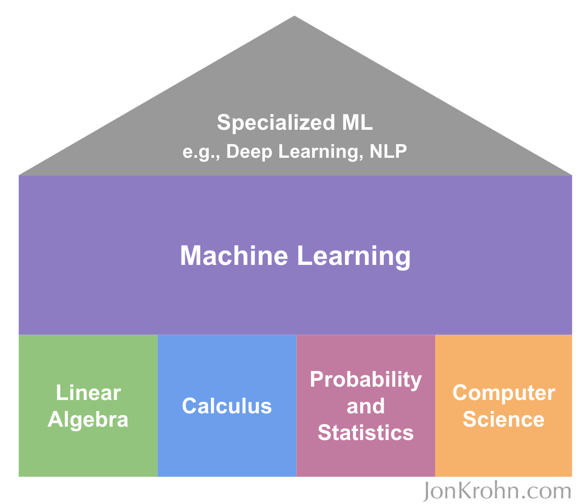
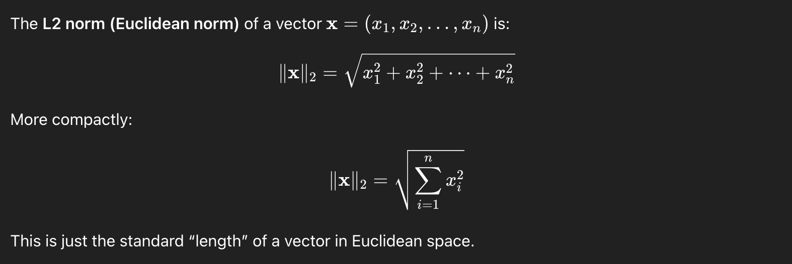
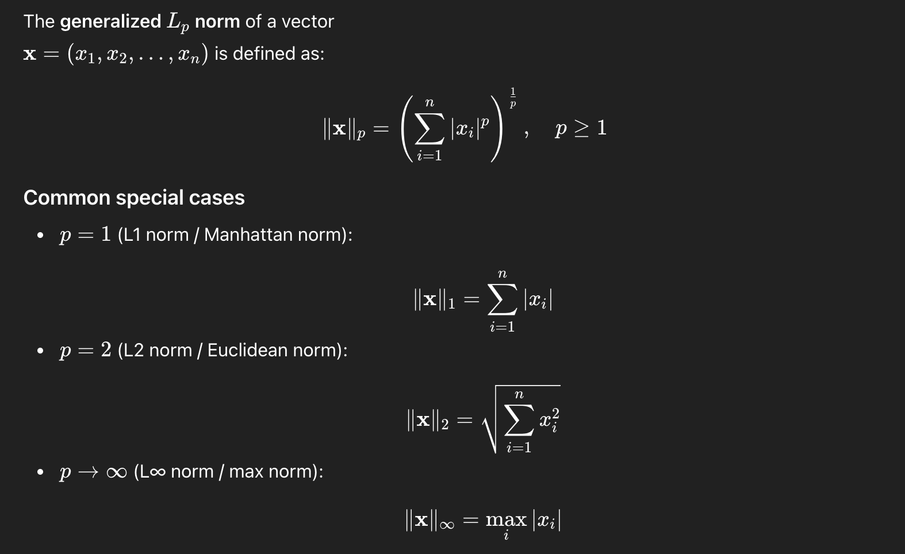
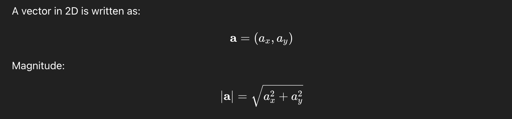
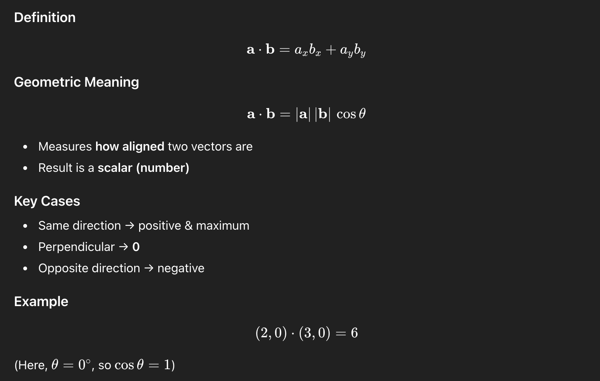
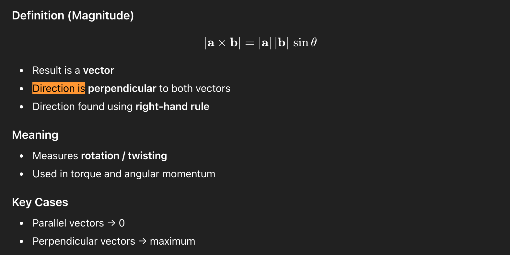

# Mathematical Foundations for Machine Learning



The diagram presents machine learning as a structure supported by four foundations: linear algebra, calculus, probability and statistics, and computer science. Machine learning supports more specialized areas such as deep learning and natural-language processing.

## Linear algebra

Consider the equation

$$
2.5t = 3(t - 5).
$$

A linear equation or system can have one solution, no solution, or infinitely many solutions. Geometrically, two lines can intersect once, be parallel, or lie exactly on top of one another.

**Related notebook:** [Introduction to linear algebra](../../notebooks/02-mathematics/01-introduction-to-linear-algebra.ipynb)

For one data point, a linear model can be written as

$$
y = a + bx_1 + cx_2 + \cdots + mx_m.
$$

The original visual is retained below:


> The output $y$ is a **weighted sum of features**, plus a constant offset.

Where:

- $x_1, x_2, \ldots, x_m$ are the **features**, or measurable properties of one data point.
- $a$ is the **bias** or **intercept**, which provides a baseline value.
- $b, c, \ldots, m$ are the **weights**, which quantify how strongly each feature contributes.

Example (house pricing):

- $x_1$ = size
- $x_2$ = number of bedrooms
- $x_3$ = age of the house
- $y$ = price


The **features are known**, the **output is known**, but the **relationship is unknown**.

So:

- We measure $x_1, x_2, \ldots, x_m$.
- We observe $y$.
- We **solve for the coefficients** that best explain their relationship.

In other words:

> The coefficients *define the model*.


For many data points, the individual equations form a system:

$$
y^{(i)} = a + bx_1^{(i)} + cx_2^{(i)} + \cdots + mx_m^{(i)},
\qquad i=1,\ldots,n.
$$


In compact matrix form:

$$
\mathbf{y} = X\mathbf{w}.
$$

Tensor libraries such as TensorFlow and PyTorch are efficient at performing these batched matrix operations.


Where:

- $X$ is the matrix of **features**.
- $\mathbf{w}$ is the vector of **unknown coefficients**, such as $[a,b,c,\ldots]^\mathsf{T}$.
- $\mathbf{y}$ is the vector of known outputs.

This is why notes say:

> We solve for $a,b,c,\ldots,m$.

Because once you know them:

* You can predict new outputs
* You understand feature importance
* You’ve captured the pattern in the data


### Why the bias exists

Without $a$:

$$
y = bx_1 + cx_2 + \cdots + mx_m.
$$

This **forces the model through the origin**: when all features are zero, $y=0$.

The bias allows:

* A baseline value
* Vertical shifting
* Better real-world modeling

In practice, $a$ can be handled by adding a constant feature $x_0=1$.


**Why this is *not* just math — it’s modeling**

You’re not solving equations just to “get numbers”.

You’re answering:

* “How much does each feature matter?”
* “What is the underlying rule connecting inputs to outputs?”

That’s why:

- Statisticians call it **regression**.
- ML practitioners call it **learning**, with $x_i$ as model inputs and $y$ as the label.
- Linear algebra practitioners call it **solving a system**.

Same idea, different lens.


**One-sentence intuition (the money line)**

> We solve for $a,b,c,\ldots$ because they describe the **relationship** between features and output. Once estimated, the model can make predictions for new data.

## Machine-learning optimization

### Statistics versus machine learning

Both statistics and ML try to learn patterns from data, but they differ in scale and modeling flexibility.

- A traditional statistical approach works very well on smaller, structured datasets and highly interpretable models.
- The ML optimization approach is designed to scale to massive datasets and very high-dimensional feature spaces (billions of data points and thousands to millions of features).

In particular, deep learning enables us to:
- Handle many input features and large raw inputs like images, videos, and audio.
- Handle many outputs, including outputs at different stages of a model.
- Automatically learn hierarchical and highly abstract patterns in input data.
- Capture non-linear relationships that are hard to encode manually.

Trade-off:
- Deep learning models are usually less explainable than classical statistical models.

### Objective functions

Objective function is also called a criterion.

- We define a function $f(x)$ and optimize it by adjusting model parameters.
- In ML, minimizing is usually more common than maximizing.
- When minimizing, $f(x)$ is often called a cost, loss, or error function.

Minimizing objective:
- Find $x^*$ where $f(x)$ is minimal.
- Notation: $x^* = \operatorname*{arg\,min}_x f(x)$.

Maximizing objective:
- Also important in specific ML areas.
- Example: reinforcement learning reward maximization.
- Notation: $x^* = \operatorname*{arg\,max}_x f(x)$.

This naturally leads to regression losses and error metrics.

### Mean absolute error

Once we choose a model, we need a way to measure how good or bad its predictions are.

For regression, let $y_i$ be the true value, $\hat{y}_i$ the predicted value, and $n$ the number of data points.

For MAE:

$$
\operatorname{MAE} = \frac{1}{n}\sum_{i=1}^{n}\left|y_i - \hat{y}_i\right|
$$

  - Interpretable and relatively robust to outliers compared to MSE: MAE is the average absolute error in the original target unit (for example, dollars), so it is easy to explain; and because errors are not squared, one very large error increases MAE linearly instead of disproportionately.
  - Every error contributes linearly.
  - Why we take absolute value? Because prediction error is a distance from the true value, and distance should be non-negative regardless of whether the prediction is above or below the target. Taking absolute value ensures positive errors are not canceled by negative ones, so the metric measures magnitude of error rather than signed bias.

### Mean squared error

For MSE:

$$
\operatorname{MSE} = \frac{1}{n}\sum_{i=1}^{n}\left(y_i - \hat{y}_i\right)^2
$$

  - Penalizes large errors more heavily due to squaring.
  - Smooth and optimization-friendly, widely used for training.

Related metric (often reported together with MSE): RMSE

$$
\operatorname{RMSE} = \sqrt{\frac{1}{n}\sum_{i=1}^{n}\left(y_i - \hat{y}_i\right)^2}
$$

  - Same outlier sensitivity pattern as MSE.
  - Returns error in the same unit as the target variable.

How to choose quickly:
- Prefer MAE when robustness and interpretability are priorities.
- Prefer MSE when you want stronger penalties for large misses and smoother gradients.
- Prefer RMSE when you want MSE behavior but reporting in target units.

In practice:
- Train with an objective function (often MSE for regression).
- Report one or more metrics (MAE, RMSE) based on business meaning.

From measuring error (MAE/MSE), we now move to how we minimize it during training.

### Minimizing cost with gradient descent

- Let the model parameters be $\theta$ and the objective be $J(\theta)$.
- Around the current point, a first-order (local linear) approximation says:

$$
J(\theta + \Delta) \approx J(\theta) + \nabla J(\theta)^\mathsf{T}\Delta.
$$

- To make $J$ smaller, choose a step $\Delta$ opposite to the gradient, the direction of steepest increase.
- Set $\Delta=-\alpha\nabla J(\theta)$, where $\alpha>0$ is the learning rate.
- Substituting gives the update rule:

$$
\theta_{t+1} = \theta_t - \alpha\nabla J(\theta_t).
$$

- Intuition:
  - gradient tells us which direction increases loss the fastest.
  - the minus sign flips that direction so we move downhill.
  - $\alpha$ controls the step size: too large can overshoot; too small can make learning very slow.
- Goal: reduce loss iteratively until updates become small or validation performance stops improving.

### Gradient descent from scratch with PyTorch

- Define parameters as tensors with gradient tracking.
- Compute loss from predictions and targets.
- Call backward pass to compute gradients.
- Update parameters and zero gradients each iteration.

### Critical points

- Critical points are where gradient is zero (or undefined).
- They can be local minima, local maxima, or saddle points.
- Optimization behavior depends on landscape curvature.

### Stochastic gradient descent

- SGD updates parameters from mini-batches instead of the full dataset.
- It is faster per step and scales better to large datasets.
- Noisy updates can help escape shallow local minima and saddle regions.

### Learning-rate scheduling

- Learning-rate scheduling changes $\alpha$ during training.
- Common strategies: step decay, cosine decay, and warmup.
- Good schedules improve stability and final model quality.

### Maximizing reward with gradient ascent

- Gradient ascent is the maximizing counterpart of gradient descent.
- Update rule: $\theta_{t+1}=\theta_t+\alpha\nabla J(\theta_t)$.
- Common in reinforcement learning when optimizing expected reward.

## Tensors

A tensor generalizes scalars, vectors, and matrices to an arbitrary number of dimensions. For example, $[x_1,x_2,x_3]$ is a one-dimensional tensor (a vector).

|   Dimension | Mathematical Name | Common ML Name | Description              | Typical dtypes                                 |
| ----------: | ----------------- | -------------- | ------------------------ | ---------------------------------------------- |
|      **0D** | Scalar            | Scalar         | Single numerical value   | `int32`, `int64`, `float32`, `float64`, `bool` |
|      **1D** | Vector            | Vector         | Ordered list of numbers  | `int32`, `float32`, `float64`, `float16`       |
|      **2D** | Matrix            | Matrix         | 2D grid (rows × columns) | `float32`, `float64`, `float16`, `bfloat16`    |
|      **3D** | 3rd-order Tensor  | 3D Tensor      | Stack of matrices        | `float32`, `float16`, `bfloat16`, `int8`       |
| **nD (≥4)** | n-th Order Tensor | Tensor         | Multi-dimensional array  | `float32`, `float16`, `bfloat16`, `int8`       |


Automatic-differentiation frameworks such as TensorFlow and PyTorch use tensors to compute gradients efficiently. Unlike ordinary NumPy arrays, framework tensors can participate directly in automatic differentiation and can be placed on supported accelerators such as GPUs. PyTorch generally feels close to NumPy and idiomatic Python; TensorFlow provides a broad training and deployment ecosystem. It is useful to become comfortable manipulating tensors with NumPy, PyTorch, and TensorFlow.


## Vectors

For example, $\mathbf{x}=[x_1,x_2]=[12,4]$ is a vector with two components.

- A vector of length two can represent a point or direction in two-dimensional space.
- A vector of length three can represent a point or direction in three-dimensional space.
- A length-$n$ vector belongs to an $n$-dimensional space. Spaces beyond three dimensions are difficult to visualize but mathematically and computationally routine.
- Vector transposition: converting row vector to column vector and vice versa
  - Row vector: $[x_1\;x_2\;x_3]$, with shape $(1,3)$ when represented explicitly as a matrix.
  - Column vector: $[x_1\;x_2\;x_3]^\mathsf{T}$, with shape $(3,1)$.
- A vector represents both a **magnitude** and a **direction** in space.
- Norms are functions that measure (quantify) the size or length of vectors.
  - $L^1$ norm (Manhattan norm): $\lVert\mathbf{x}\rVert_1=\sum_{i=1}^{n}|x_i|$.
  - $L^2$ norm (Euclidean norm): $\lVert\mathbf{x}\rVert_2=\sqrt{\sum_{i=1}^{n}x_i^2}$.
  
    - It is the most common norm used in ML
  - Squared $L^2$ norm: $\lVert\mathbf{x}\rVert_2^2=\sum_i x_i^2=\mathbf{x}^\mathsf{T}\mathbf{x}$. Avoiding the square root makes it cheaper to compute.
  - $L^\infty$ norm (maximum norm): $\lVert\mathbf{x}\rVert_\infty=\max_i|x_i|$.
  
  
  
- Unit vector: a vector with magnitude $1$, representing direction only.
  - Normalize a nonzero vector with $\mathbf{u}=\mathbf{v}/\lVert\mathbf{v}\rVert_2$.
  - For $\mathbf{v}=[3,4]$, $\lVert\mathbf{v}\rVert_2=\sqrt{3^2+4^2}=5$, so $\mathbf{u}=[3/5,4/5]=[0.6,0.8]$.
- Basis Vectors:
  - They can be scaled to represent any vector in that space.
  - In 2D, the standard basis vectors are $\mathbf{i}=[1,0]$ and $\mathbf{j}=[0,1]$.
  - In 3D, they are $\mathbf{i}=[1,0,0]$, $\mathbf{j}=[0,1,0]$, and $\mathbf{k}=[0,0,1]$.
- Orthogonal Vectors: Two vectors are orthogonal if their dot product is zero.
  - For $\mathbf{v}_1=[1,2]$ and $\mathbf{v}_2=[-2,1]$, $\mathbf{v}_1\cdot\mathbf{v}_2=(1)(-2)+(2)(1)=0$, so they are orthogonal.
  - An $n$-dimensional space can contain at most $n$ mutually orthogonal nonzero vectors.
- Orthonormal vectors are mutually orthogonal and each has unit norm.

- **Matrices**:
  - Two-dimensional matrices are like a table with rows and columns
- **Generic Tensor Notation**
  - Annotated with X. 
  - A fourth-order tensor can be written as $X_{ijkl}$, where $i,j,k,l$ index its four axes.

- **Tensor Operations**:
  - Transposition: swapping rows and columns of a matrix
  - Addition/Subtraction: element-wise addition or subtraction of matrices/tensors of the same shape
  - Hadamard product: element-wise multiplication of same-shaped tensors, written $A\odot B$ mathematically and often `A * B` in code.
  - Reduction: collapsing a tensor along specified dimensions using operations like sum, mean, max. i.e in numpy `np.sum(X)`
    - Reduction across rows: summing each column i,e in numpy `np.sum(X, axis=0)`
    - Reduction across columns: summing each row i.e in numpy `np.sum(X, axis=1)`
  - Scalar Multiplication: multiplying each element by a scalar value
  - Matrix Multiplication: combining two matrices to produce a new matrix
    - The number of columns in the first matrix must equal the number of rows in the second matrix
    - The resulting matrix has dimensions of the number of rows from the first and the number of columns from the second
    - Example:
    ```    
    A = [[1, 2, 3],
         [4, 5, 6]]
    B = [[7, 8],
        [9, 10],
        [11, 12]]
    AB = [[58, 64],
         [139, 154]]
    ```
  - Dot product:
    - Measures similarity between two vectors
    - Formula: $\mathbf{a}\cdot\mathbf{b}=\lVert\mathbf{a}\rVert\lVert\mathbf{b}\rVert\cos\theta$, where $\theta$ is the angle between the vectors.
    - If $\theta=0^\circ$, the vectors point in the same direction and the dot product is positive and maximal for their fixed lengths.
    - If $\theta=90^\circ$, the vectors are orthogonal and $\mathbf{a}\cdot\mathbf{b}=0$.
    - If $\theta=180^\circ$, they point in opposite directions and the dot product is negative.

## Solving a linear system by substitution
- For two variables:
  - Example:
    - $2x+3y=6$ (1)
    - $4x+y=5$ (2)
  - Solve (1) for y:
    - $y=(6-2x)/3$
  - Substitute into (2):
    - $4x+(6-2x)/3=5$
    - Multiply through by 3 to eliminate fraction:
      - $12x+6-2x=15$
      - $10x=9$
      - $x=9/10=0.9$
    - Substitute back to find y:
      - $y=(6-2(0.9))/3=(6-1.8)/3=4.2/3=1.4$
    - Solution: $x=0.9$, $y=1.4$.

The related notebooks contain further derivations and executable examples.
---
- **Reference note for trigonometry**:
  - Sine (sin): opposite/hypotenuse
  - Cosine (cos): adjacent/hypotenuse
  - Tangent (tan): opposite/adjacent
  - Pythagorean theorem: $a^2+b^2=c^2$
  - Radians versus degrees: $360^\circ=2\pi$ radians
  - Common angles:
    - 0 degrees = 0 radians
    - 30 degrees = π/6 radians
    - 45 degrees = π/4 radians
    - 60 degrees = π/3 radians
    - 90 degrees = π/2 radians

A **vector** has:

* **Magnitude** (length)
* **Direction**

Examples: displacement, velocity, force.

A vector in 2D is written as:


- Dot Product (·)




- Cross Product (×)



- Right-Angled Triangle Trigonometry:

For an acute angle **θ**:
* **Hypotenuse**: longest side
* **Opposite**: across from θ
* **Adjacent**: next to θ

- SOH–CAH–TOA
  - **Sine** (sin): opposite/hypotenuse
  - **Cosine** (cos): adjacent/hypotenuse
  - **Tangent** (tan): opposite/adjacent

Trig functions are ratios, so they depend only on the angle.

- Common Trig Values
  - Sine

| θ   | sin θ  |
| --- | ------ |
| 0°  | 0      |
| 30° | 1/2    |
| 45° | √2 / 2 |
| 60° | √3 / 2 |
| 90° | 1      |

  - Cosine

| θ   | cos θ  |
| --- | ------ |
| 0°  | 1      |
| 30° | √3 / 2 |
| 45° | √2 / 2 |
| 60° | 1/2    |
| 90° | 0      |

  - Tangent
    - sin θ / cos θ

| θ   | tan θ     |
| --- | --------- |
| 0°  | 0         |
| 30° | 1 / √3    |
| 45° | 1         |
| 60° | √3        |
| 90° | undefined |


- Key Connections to Remember

* **Dot product → cosine → alignment**
* **Cross product → sine → perpendicularity**
* Components of vectors already include trig
* Trig comes from **right-angled triangles**
