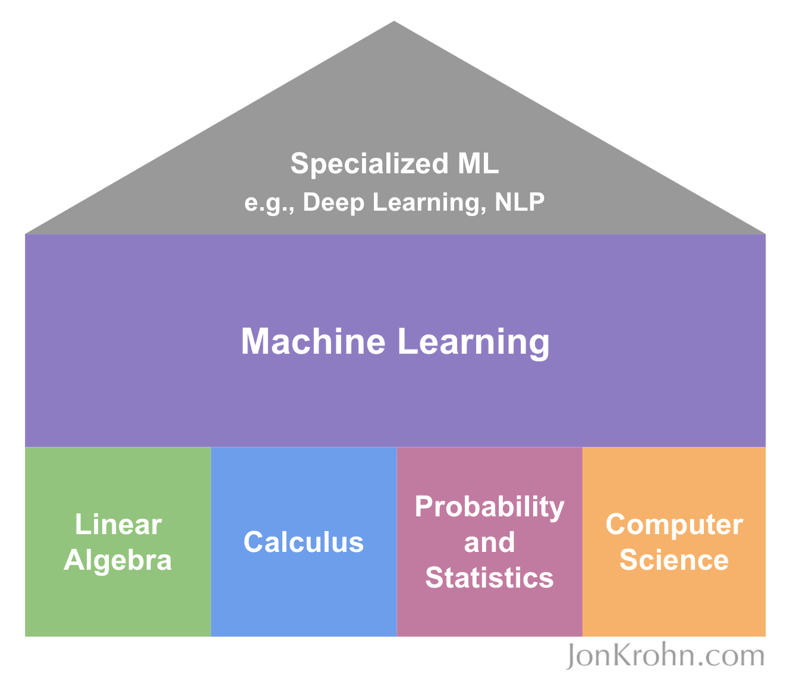

# Searchable Notes for Notebook Visuals

This file records the meaning of diagrams embedded as notebook attachments. The images remain inside their original notebooks; these notes make their important content searchable without turning the notebooks into code-only documents.

## Learning foundations diagram

Used in the linear-algebra and algorithms notebooks. Linear algebra, calculus, probability and statistics, and computer science form the foundation. Machine learning builds on these subjects, while specialized fields such as deep learning and natural-language processing build on machine learning.

## Linear algebra II

### Shear transformation and eigenvectors

The shear image shows two vectors before and after a linear transformation. The red vector changes direction, while the blue vector does not. An eigenvector is precisely a nonzero vector whose direction is preserved by a linear transformation, although its length may change and a negative eigenvalue may reverse its orientation:

$$
A\mathbf{v}=\lambda\mathbf{v}.
$$

Here $\mathbf{v}$ is an eigenvector and $\lambda$ is its eigenvalue.

### Squared error for a fitted line

For the line $\hat{y}_i=ax_i+b$, each residual is the vertical difference

$$
e_i=y_i-(ax_i+b).
$$

Least-squares regression chooses $a$ and $b$ to minimize

$$
\operatorname{SSE}=\sum_{i=1}^{n}\left[y_i-(ax_i+b)\right]^2.
$$

Squaring prevents positive and negative residuals from cancelling and penalizes larger errors more heavily.

## PyTorch regression, derivatives, and integrals

### Training loop

The diagram shows the core supervised-learning cycle:

1. Perform a forward pass, such as $\hat{y}=mx+b$.
2. Compare $\hat{y}$ with the true $y$ to calculate a cost $C$.
3. Use the chain rule and backpropagation to compute gradients of $C$ with respect to parameters such as $m$ and $b$.
4. Adjust the parameters in a direction that reduces $C$, then repeat.

With learning rate $\alpha$, a parameter $w$ is updated by

$$
w\leftarrow w-\alpha\frac{\partial C}{\partial w}.
$$

Mini-batch training divides the full dataset into smaller batches. Each batch makes a forward pass, produces a loss, and contributes gradients used for a parameter update. This reduces memory requirements and creates noisier but more frequent updates than full-batch training.

### Higher-order derivatives

The distance-time curve illustrates that its first derivative is speed:

$$
v(t)=\frac{\mathrm{d}d}{\mathrm{d}t},
$$

and the derivative of speed is acceleration:

$$
a(t)=\frac{\mathrm{d}v}{\mathrm{d}t}
=\frac{\mathrm{d}^2d}{\mathrm{d}t^2}.
$$

A horizontal tangent has slope zero. A positive slope indicates increase and a negative slope indicates decrease.

### Classification thresholds and ROC space

The visual uses four examples with true labels $[0,1,0,1]$ and scores $[0.3,0.5,0.6,0.9]$. Classifying a score as positive when it is strictly above the threshold gives:

| Threshold | Predictions | TPR | FPR |
| ---: | --- | ---: | ---: |
| $0.3$ | TN, TP, FP, TP | $1.0$ | $0.5$ |
| $0.5$ | TN, FN, FP, TP | $0.5$ | $0.5$ |
| $0.6$ | TN, FN, TN, TP | $0.5$ | $0.0$ |

The rates are

$$
\operatorname{TPR}=\frac{TP}{TP+FN},
\qquad
\operatorname{FPR}=\frac{FP}{FP+TN}.
$$

An ROC curve plots TPR against FPR as the threshold changes. The diagonal corresponds to random ranking; useful classifiers rise above it, and the ideal point is $(0,1)$.

### Integration

Rectangles approximate the area under a curve. As their width $\Delta x$ approaches zero, a Riemann sum approaches the definite integral:

$$
\int_a^b f(x)\,\mathrm{d}x
=\lim_{n\to\infty}\sum_{i=1}^{n}f(x_i^*)\Delta x.
$$

In $\int 2x\,\mathrm{d}x$, $2x$ is the integrand, $x$ is the variable of integration, and $\mathrm{d}x$ indicates integration with respect to $x$:

$$
\int 2x\,\mathrm{d}x=x^2+C.
$$

The shaded-area example uses $f(x)=\tfrac12x$ from $x=1$ to $x=2$:

$$
\int_1^2\frac{x}{2}\,\mathrm{d}x
=\left[\frac{x^2}{4}\right]_1^2
=1-\frac14
=\frac34.
$$

## Probability and information theory

### Five coin tosses

The bar chart is the binomial distribution for the number $K$ of heads in five fair tosses:

$$
P(K=k)=\binom{5}{k}(0.5)^k(0.5)^{5-k}.
$$

The distribution is symmetric and is largest near two or three heads.

### Location and quantiles

The gamma-distribution visual marks the mean $\mu$, median $m$, first quartile $Q_1$, and third quartile $Q_3$. The middle half of the observations lies between $Q_1$ and $Q_3$; its width is the interquartile range $Q_3-Q_1$. For a right-skewed distribution, the long right tail commonly pulls the mean to the right of the median.

### Key-term inventory from the handwritten summary

- Foundations: event, sample space $\Omega$, factorial, “$n$ choose $k$,” law of large numbers, random variable, PMF, PDF, expected value, joint probability, marginal probability, conditional probability, probability chain rule, independence $X\perp Y$, and conditional independence $X\perp Y\mid Z$.
- Summaries: mean, median, mode, quantiles, variance $\sigma^2$, standard deviation $\sigma$, standard error $\sigma_{\bar{x}}$, covariance, and correlation.
- Information theory: self-information, Shannon entropy, differential entropy, and cross-entropy.
- Limit theorem and distributions: central limit theorem; uniform, normal, log-normal, exponential, Laplace, binomial, multinomial, Poisson, and mixture distributions.

## Algorithms and data structures

### Runtime growth

As input size $n$ increases, the displayed order from slower growth to faster growth is generally

$$
O(1)<O(\log n)<O(n)<O(n\log n)<O(n^2)<O(2^n)<O(n!).
$$

Typical examples from the visual are:

| Complexity | Name | Example |
| --- | --- | --- |
| $O(1)$ | Constant | Read the first list item; check whether a stored length is odd or even |
| $O(\log n)$ | Logarithmic | Binary search |
| $O(n)$ | Linear | Linear search; print every list item |
| $O(n\log n)$ | Linearithmic | Merge sort; average-case quicksort |
| $O(n^2)$ | Quadratic | A simple nested loop; bubble sort |
| $O(2^n)$ | Exponential | Enumerate all subsets or combinations |
| $O(n!)$ | Factorial | Enumerate all permutations; brute-force traveling-salesperson search |

Big-O describes asymptotic growth, not an exact running time. Constants, implementation details, input shape, and worst/average/best-case assumptions still matter.

### Tree terminology

The tree visual has root value $25$. Root depth is $0$ and level is $1$. Children $3$, $5$, and $17$ are at depth $1$. Nodes $26$, $22$, and $1$ are at depth $2$, and leaf $8$ is at depth $3$. Depth counts edges from the root to a node; a node’s height counts the longest downward path from that node to a leaf. Thus leaf height is $0$ and this tree’s root height is $3$.
