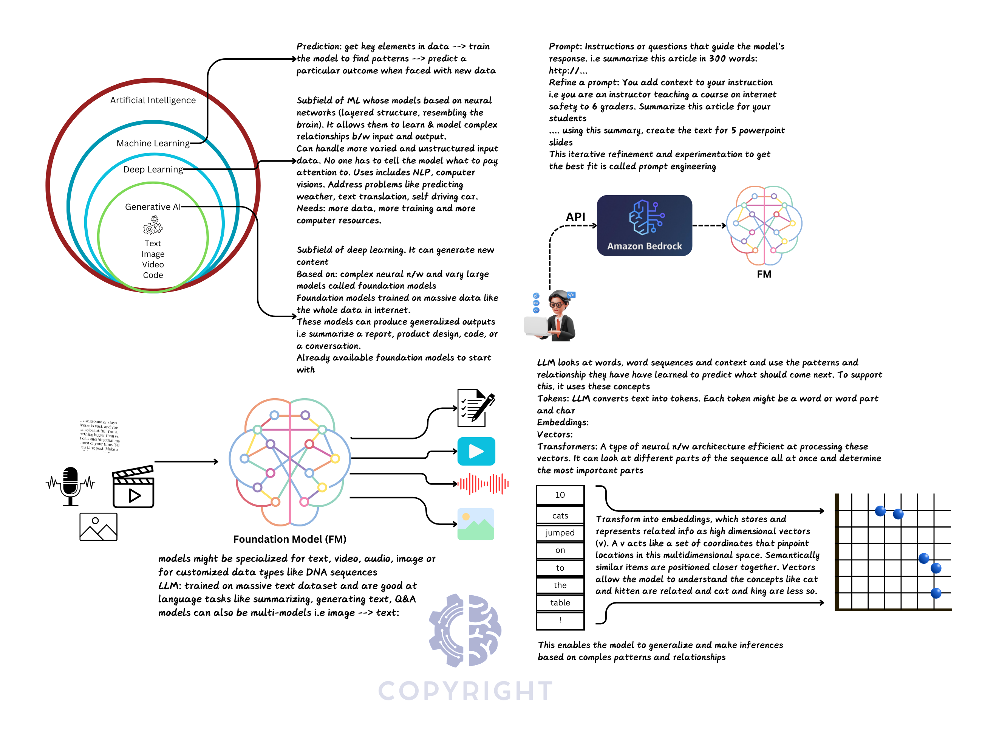
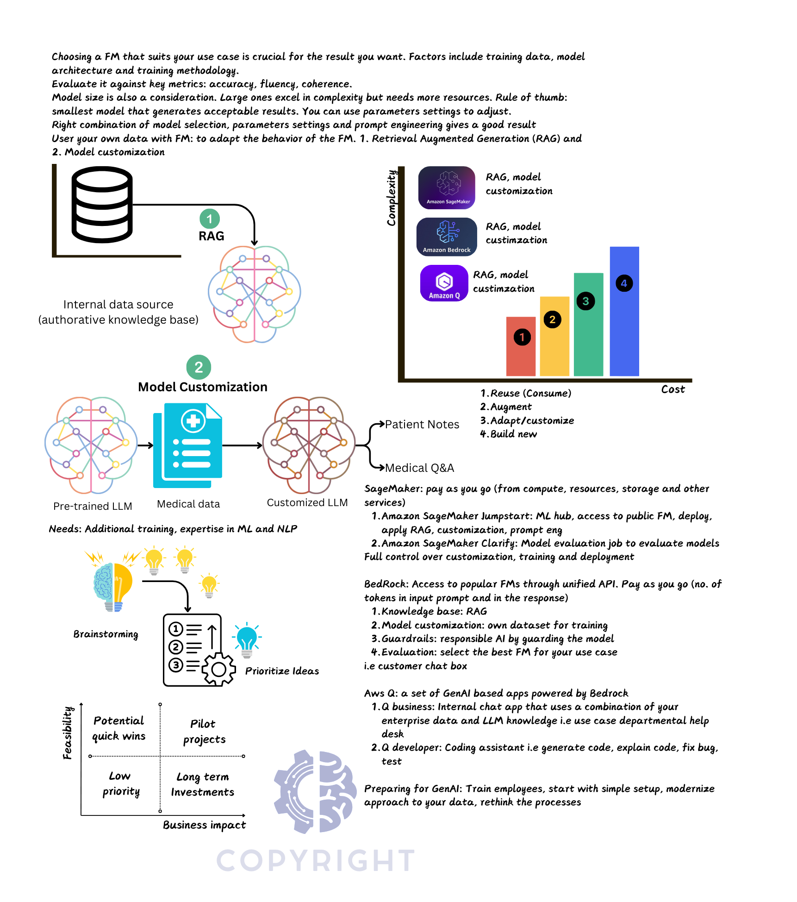
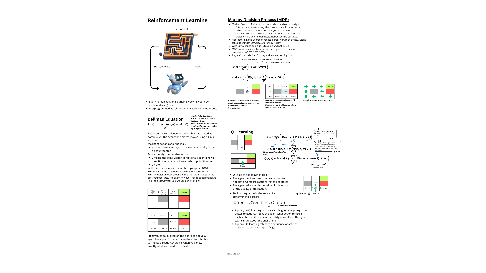
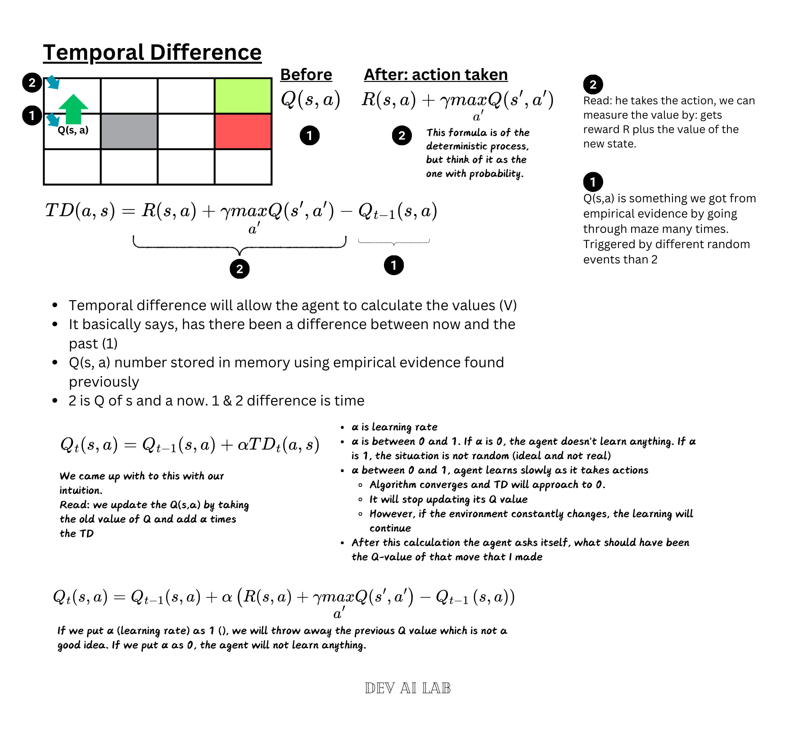
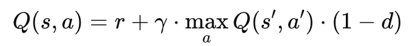
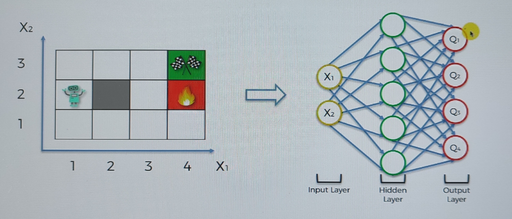
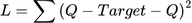
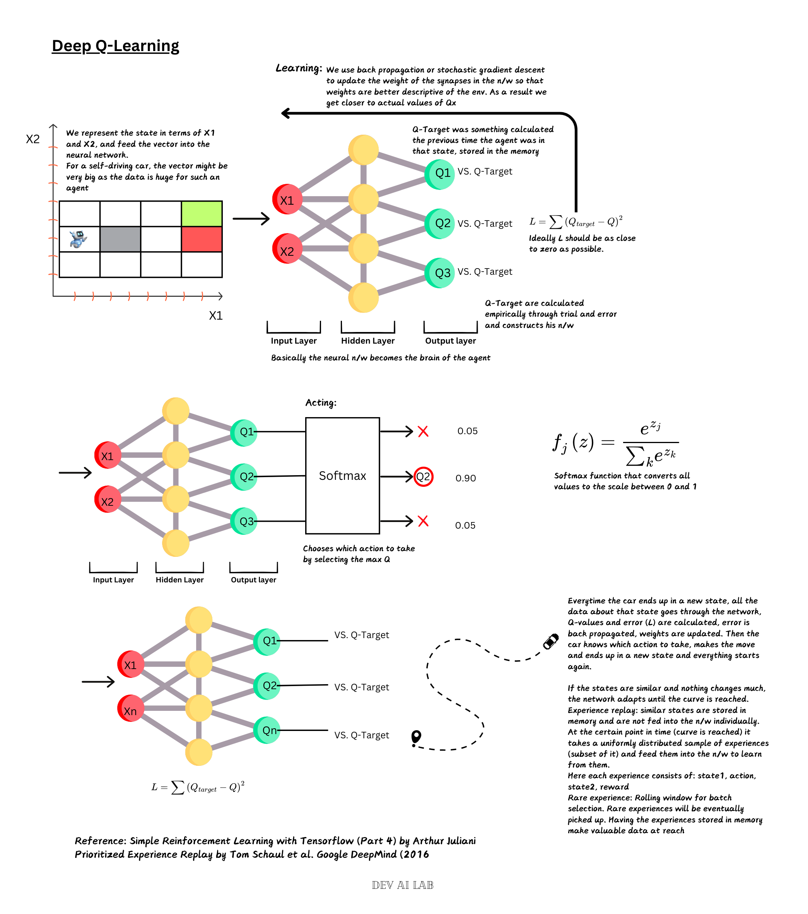
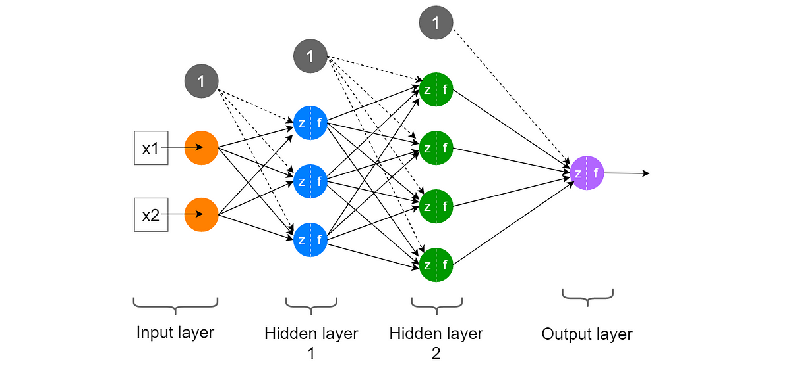
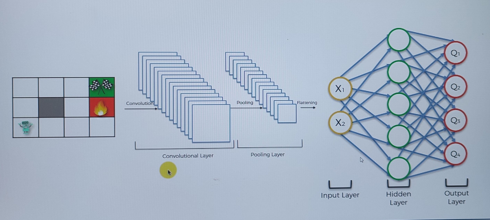

# Artificial Intelligence and Reinforcement Learning

## AI, machine learning, deep learning, and generative AI

The first visual shows a useful nesting: generative AI is commonly built with deep-learning models; deep learning is a subfield of machine learning; and machine learning is one approach within AI. Machine learning learns patterns for prediction, deep learning uses multilayer neural networks to learn complex representations, and generative AI produces new text, images, audio, video, or code. Foundation models are trained on broad data and may be specialized for a modality or adapted to a particular domain.

Large language models split text into tokens, represent those tokens as high-dimensional embedding vectors, and use transformer architectures to model relationships among tokens. Semantically related items tend to occupy nearby regions of an embedding space. A prompt supplies instructions; prompt refinement adds the context, audience, constraints, and desired output needed for a more useful response.

The second visual contrasts ways to use a foundation model:

1. **Reuse** an existing model through a prompt or API: lowest cost and complexity.
2. **Augment** it with retrieval-augmented generation (RAG), which supplies relevant information from an authoritative knowledge base at request time.
3. **Customize** it with domain data, which requires additional training expertise and resources.
4. **Build** a new model: greatest cost and complexity.

Choose the smallest model that produces acceptable results, then evaluate accuracy, fluency, coherence, latency, safety, and cost for the real use case. Prioritize candidate projects by feasibility and business impact: quick wins are high-impact and feasible, pilot projects are high-impact but harder, and low-impact work should receive correspondingly lower priority. The source visual also records AWS examples: SageMaker for end-to-end model development, Bedrock for managed access to foundation models, knowledge bases, customization, guardrails and evaluation, and Amazon Q for business and developer assistants.

- Important specialist roles:
  - data analyst: 
    - insights, reports, query dbs, data visualization. 
    - Uses: sql, tableau, PowerBI, python, R
  - data engineer: 
    - collect, process data with software engineering background. 
    - Uses: ETL, Spark, Hadoop, Kafka, DBs, clouds
  - data scientist: 
    - solves a real/business problem, R&D to invent new models. 
    - Uses: ML, deep learning theory, advanced python/R, Jupyter Notebook (Numpy, scipy, pandas, Scikit-learn, Matplotlib) 
    - Deep Neural N/W: Pytorch, Tensorflow, 
    - LLMs: HuggingFace Transformers
  - ML Engineer
    - Productionize ML models, understands data science, deploy and scale models
    - Combines software engineering with data science
    - Uses: Broad data science, software engineering, CI/CD, Cloud deployments, docker, k8s, data pipeline frameworks (spark, hadoop, kafka), advanced python
  - New one: LLM engineer

- Career Path:
- Three major learning settings are:
  - Supervised learning
  - Unsupervised learning
  - Reinforcement learning: challenge specific to this is trade-off between exploration and exploitation

## Responsible AI
- Fairness: toxicity, intellectual property, avoid hallucinations
- Privacy
- Safety
- Transparency
- Add filters using AWS Guardrail against harmful content, disallowed topic, mask sensitive info, filter out hallucinations
## Protect your data
- encrypt data in transit and in rest across the AI cycle
- secure the model, data and lineage data
## Good start
- Start with people's training
- Be responsible ai driver
- Create plan, modernize data governance
- find a good pilot project
- make good choices

## Reinforcement learning

[Simple Reinforcement Learning with Tensorflow](https://medium.com/emergent-future/simple-reinforcement-learning-with-tensorflow-part-0-q-learning-with-tables-and-neural-networks-d195264329d0)
### Bellman equation

For a deterministic transition, the optimal state value satisfies

$$
V^*(s)=\max_a\left[R(s,a)+\gamma V^*(s')\right].
$$

For stochastic transitions:

$$
V^*(s)=\max_a\left[R(s,a)+\gamma\sum_{s'}P(s'\mid s,a)V^*(s')\right].
$$

Here $s$ is the current state, $a$ an action, $s'$ a possible next state, $R(s,a)$ the immediate reward, $P(s'\mid s,a)$ the transition probability, and $\gamma\in[0,1)$ the discount factor. The discount reduces the present contribution of rewards farther in the future.

### Markov Decision Process (MDP)
- additional [references](https://www.it.uu.se/edu/course/homepage/aism/st11/MDPApplications3.pdf)

An MDP formally consists of states, actions, transition probabilities, rewards, and a discount factor. The earlier notes summarize the agent-facing loop as **sensation, action, and goal**: the agent observes a state, takes an action, and receives feedback connected to the goal.

- Reinforcement learning learns from rewards produced through interaction.
- Supervised learning learns from labelled examples supplied in a training set.

### Policy vs Plan
- A **plan** is a fixed sequence of actions for a known situation.
- A **policy** $\pi(a\mid s)$ maps states to actions or action probabilities. It can respond dynamically to stochastic transitions, so it is more general than a fixed plan.

### Living Penalty of the agent
- A small negative reward per time step encourages the agent to finish efficiently because delay accumulates cost.
- It is rewarded throughout the process instead of just at the end (+1, -1)
- A mild penalty such as $-0.04$ may change values only near danger, while stronger penalties such as $-0.5$ or $-2$ can substantially change the learned behavior. Exact effects depend on the reward scale and environment.
### Q-Learning (value of actions)
- Instead of assigning only a value to a state, Q-learning estimates the quality $Q(s,a)$ of taking action $a$ in state $s$.

The optimal action-value function satisfies

$$
Q^*(s,a)=R(s,a)+\gamma\sum_{s'}P(s'\mid s,a)\max_{a'}Q^*(s',a').
$$

In a deterministic environment, the sum over possible next states reduces to the single observed next state.

#### Temporal Difference (How AI updates itself)

After observing the transition $(s,a,r,s')$, Q-learning forms a one-step target and temporal-difference error:

$$
y_t=r+\gamma\max_{a'}Q_t(s',a'),
$$

In implementations that encode episode termination with $d\in\{0,1\}$, the target is commonly masked as

$$
y_t=r+\gamma(1-d)\max_{a'}Q_t(s',a').
$$

When $d=1$, no future value is added because the next state is terminal.

$$
\delta_t=y_t-Q_t(s,a).
$$

It then updates the stored estimate:

$$
Q_{t+1}(s,a)=Q_t(s,a)+\alpha\delta_t,
$$

where $\alpha\in(0,1]$ is the learning rate. With $\alpha=0$ nothing is learned; with $\alpha=1$ the old estimate is replaced entirely by the latest target, which can be unstable in a stochastic environment.

#### Additional Reading
- Markov Decision Processes: Concepts and Algorithms by Martijn van Otterlo (2009)

### Deep Q-Learning Intuition
#### Q-learning intuition (Learning)
#### Q-learning intuition (Acting)
- A vector describing the current state enters the neural network through its input layer.
- The output layer produces one estimated Q-value for each available action.
- During learning, the predicted values are compared with temporal-difference targets and the error is backpropagated to update the network weights.
- During acting, the policy selects an action from these Q-values while balancing exploitation with exploration.

The grid-world visual below shows this mapping explicitly: state coordinates such as $(x_1,x_2)$ enter the network and the output nodes $Q_1,\ldots,Q_4$ estimate the values of the four possible actions.

For a batch of predictions, the depicted squared-error objective is

$$
L=\sum_i\left(Q_{\text{target},i}-Q_i\right)^2.
$$

#### Experience Replay
- example of car moving in the street
- car makes move, new state, propagate in the network, key values and errors calculated and back propagated, weights updated, then cars selects which action to take, ends up in new state and the cycle starts again
- It samples stored experiences of the form $(s,a,r,s')$, often uniformly within a mini-batch.
- There are also special/rare experiences (i.e sharp corners)
- experience replay helps learn faster especially when experiences are limited
- Prioritize Experience [Replay](https://arxiv.org/pdf/1511.05952): explore uniform distribution for experience replay

#### Action-selection policies: exploration and exploitation

Exploitation selects the action currently believed to be best; exploration gathers evidence about alternatives that might be better.

- Epsilon-greedy chooses a random action with probability $\varepsilon$ and a greedy action with probability $1-\varepsilon$. For $\varepsilon=0.1$, it explores about 10% of the time.
- An epsilon-soft policy gives every action nonzero probability. This term is broader than simply reversing epsilon-greedy; the essential property is that no action becomes impossible.
- Continued exploration helps avoid committing too early to a suboptimal action.
- Softmax sampling converts action scores into probabilities:
$$
p(a_j\mid s)=\frac{e^{z_j/\tau}}{\sum_k e^{z_k/\tau}},
$$

where temperature $\tau$ controls randomness. Lower temperatures concentrate probability on the best-scoring action; higher temperatures explore more broadly.
- Further reading [here](https://tokic.com/www/tokicm/publikationen/papers/AdaptiveEpsilonGreedyExploration.pdf)
- 

### Deep convolutional Q-learning
- A standard DQN consumes a state vector. When the state is available as pixels, a convolutional network can extract visual features before fully connected layers produce an estimated Q-value for each action.
- Discussed here:
  - Deep convolutional q-learning intuition
  - Eligibility Trace (N-step Q-learning)
- To strengthen the theory, refer to these:
  - Richard S. Sutton and Andrew G. Barto 1998 Reinforcement Learning: [An Introduction](http://incompleteideas.net/book/RLbook2020.pdf)
  - Volodymyr Mnih et al. 2016, Asynchronous Methods for Deep RL
- RL two distinguishing features:
  - trial-and-error search
  - delayed reward
- In reality, we can't feed the state vector at input layer. The agent has to see the environment itself.
- Agent has to process the images the environment is supplying to the agent, the same as human.

## Links
- Code from A-Z [course](https://drive.google.com/drive/u/0/folders/15dfDBwqC-3mMw6luTz11V00SBggDVQPH)
- 
