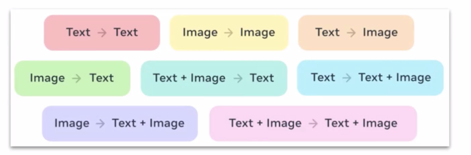

# Generative AI

## Multimodal models and embedding spaces

A multimodal system accepts or produces more than one type of data. The visual records these mappings: text to text, image to image, text to image, image to text, text-plus-image to text, text to text-plus-image, image to text-plus-image, and text-plus-image to text-plus-image. A shared embedding space represents different modalities as vectors so that related content—such as a description of a dog carrying a stick and a matching image, video, or sound—can be retrieved by similarity.

For embedding vectors $\mathbf{x}$ and $\mathbf{y}$, cosine similarity is commonly used:

$$
\operatorname{cos\_sim}(\mathbf{x},\mathbf{y})
=\frac{\mathbf{x}\cdot\mathbf{y}}
{\lVert\mathbf{x}\rVert_2\lVert\mathbf{y}\rVert_2}.
$$

Values closer to $1$ indicate stronger directional similarity. This is a similarity measure, not proof that two items have identical meaning.

### AWS examples
- Example
  - chap [10](https://github.com/generative-ai-on-aws/generative-ai-on-aws/tree/main/10_multimodal)
  - Weaviate [example](https://github.com/generative-ai-on-aws/generative-ai-on-aws/blob/main/10_multimodal/11_multimodal_rag_weaviate.ipynb)
    - search dog with stick --> get image, video, sound
  - Text to video startup introduction

## Large language models

### Prompt engineering
- Prompt pattern:
  - Persona i.e act as a sceptic that is well versed in computer science
  - Question refinement pattern i.e suggestion alternative to my question to optimize the response
  - Audience persona pattern i.e explain gravity to me. assume I am a 12 grade student
  - Cognitive verifier pattern i.e what prompt is ideal --> ask and let him suggest additional questions
  - Flipped interaction pattern: very novice, ask me questions and then let me know the plan based on my answers
  - Recipe pattern:
  - Prompt: Trigger phrase, content, context(optional)
  - Open-ended prompts vs close-ended prompts
  - Prompt Engineering is the art of optimizing prompts to get the desired output from LLMs
  - AI (Learning, Reasoning, Self-correction)
  - ML (Supervised, Unsupervised, Reinforcement)
  - NLP (Text classification, Sentiment analysis, Named entity recognition, Language translation, Text generation)
  - LLMs (Training on massive datasets, versatility, adaptability)
- Prompt Techniques:
  - How design prompts:
    - Clarity and conciseness
    - Contextual relevance
    - Use modifiers
    - Goal orientation
    - directness, specificity, simplicity language, avoiding open-ended questions, prompt iteration (feedback loop)
  - Prompt length: Brief prompts, detailed prompts, verbose prompts, highly verbose, role-playing prompts
  - Prompt modifiers: 
    - tone (polite, professional,sarcasm etc), 
    - style (formal, informal), 
    - format (bullets points, dialogue, essay, summary), 
    - perspective (first person, second person, objective, subjective), 
    - complexity (simple, complex, technical, layman's term, advanced), 
    - purpose (instructional, exploratory, argumentative, descriptive, comparative), 
    - audience (beginners, experts, for children, for business professionals, academic, public)
  - Contextual Influence on AI outputs:
    - Prior conversations and continuity
    - External Data (i.e use recent data)
    - Embedded Knowledge (i.e domain-specific terms)
    - Cultural and Temporal Context (i.e current events, cultural references)
  - Prompt Priming:
    - Topic-specific priming
    - Opinion priming
    - Tone and style priming
    - Context-specific priming
  - Prompt Engineering Techniques
    - Zero-shot prompting
    - One-shot
    - Multi-shot or few-shot
    - Role 
    - Tabular format
    - Ask before answering
    - Fill in the blanks
    - Perspective prompting
    - Chain-of-thought prompting
    - Generated Knowledge prompting
  - Where to deploy prompts design strategies:
    - Project Management Optimization
    - Client Interaction and reporting
    - Market Research and Analysis
    - Strategic decision support
    - Innovation and Development
    - Chatbots and virtual assistants
    - Content generation tools
    - Customer support systems
    - Educational platforms
    - Data analysis and insights tools
    - Creative writing aids
    - Code generation tools
    - Personal productivity applications
  - Best practices in prompt engineering:
    - Using the latest AI models: 
      - GPT-4 (OpenAI): Text understanding and generation
      - Claude (Anthropic): Conversational AI with safety focus
      - Gemini (Google): Improved understanding of contexts and nuances, advanced NLP
      - DALLE-3 (OpenAI): Accurate image generation from text prompts
    - Specifying Output format:
      - Text outpout
      - Structured Out: bullet points, tables, JSON etc
      - Code Output
      - Dialogue Output
    - Actionable prompts:
      - Incorporating information on what to do
        - Explicit action 
        - Scenario-based prompt
        - Use imperative language
        - Breakdown complex tasks
        - Include decision points
      - Be specific and descriptive
        - Define the specific context clearly:
        - Use precise language: i.e Design a responsive HTML website with a homepage, about page, contact form, using React, NextJs
        - Include relevant details: Write a detailed proposal for a three-month digital marketing campaign targeting males aged 25-35, using social media platforms with a budget of 50,000 USD.
        - Specify desired format: state explicitly.
        - Ask for examples: ... and provide real time examples
### Transformer
- A transformer uses attention to relate tokens across a sequence and process those relationships in parallel.
- A broadly trained foundation model can be adapted to business knowledge later through prompting, RAG, or model customization. RAG changes the supplied context without changing model weights; fine-tuning or continued training changes model behavior by updating weights.

### GANs
- A generative adversarial network trains a generator to create samples and a discriminator to distinguish generated samples from real ones. Their competition can produce realistic outputs, although training may be unstable and can suffer from mode collapse.

### Drawbacks
- Hallucinations: if creativity there, Hallucinations is there too - responsible AI
- Biases: due to data it was trained on 
- Black: lack of transparency because of complex mathematics - explainable AI
- Disclosure rules and privacy

### Future of GenAI
- bigger and better models
- transition from content generation to action using IoT technologies etc - agentic AI

### Agentic AI
- Agentic systems are action-oriented and combine a model with instructions, state or memory, tools, and a control loop.
- A practical loop is: perceive the current state, reason or plan, take an action through a tool, observe the result, and repeat until a stopping condition is reached.
- It revolutionizes health and finance sectors

## LLM  Evaluation
- Local Setups:
  - Ollama(Local LLMs, REST API, Llama, Gemma, Phi, Deepseek, Qwen, Graphite)
  - Anything LLM --> Open WebUI
  - Goose CLI
  - Copilot CLI
  - HuggingFace
- Online Setups:
  - OpenAI
  - Azure OpenAI
  - AI21 Studio
  - Cohere
  - Anthropic
  - Google PaLM
  - Llama2 via AWS Bedrock
- Custom Workflows, Automation and Evaluation:
  - LangChain
  - LlamaIndex
  - AutoGPT
  - BabyAGI
  - AgentGPT
  - AnythingLLM
  - Nodejs/Python
  - N8n/ flowise
- How to test chatbots/LLMs:
  - Human evaluation
  - Automated evaluation
  - Hybrid evaluation
  - Ollama.com/library/qwen3
  
- Evaluation types:
  - Accuracy
  - Fluency
  - Coherence
  - Relevance
  - Diversity
  - Robustness
  - Latency
  - Scalability

## GenAI use cases
- text to text
- text to image
- text to video
- text to audio
- code generation
- data analysis

- Real time use cases:
  - brainstorming and ideation
  - summarization and content distillation
  - text enhancement and editing
  - code generation and software development
  - content creation
  - customer support
  - personalized marketing
  - data analysis and insights
  - healthcare and diagnostics
  - education and training
  - gaming and entertainment
  - virtual assistants
## Resources Links
- [Reference](https://awjuliani.medium.com/simple-reinforcement-learning-with-tensorflow-part-0-q-learning-with-tables-and-neural-networks-d195264329d0) reading about deep learning:
- Training github repo [here](https://github.com/Pierian-Data/Complete-Python-3-Bootcamp.git)
- [Simple Reinforcement Learning with Tensorflow](https://medium.com/emergent-future/simple-reinforcement-learning-with-tensorflow-part-0-q-learning-with-tables-and-neural-networks-d195264329d0)
- Multi-modal [embedding](https://github.com/mlfoundations/open_clip) : (text,image), (text,video), (audio, image). No real training data
- Generative AI on [AWS](https://www.amazon.de/Generative-AWS-Context-Aware-Multimodal-Applications/dp/1098159225) 
